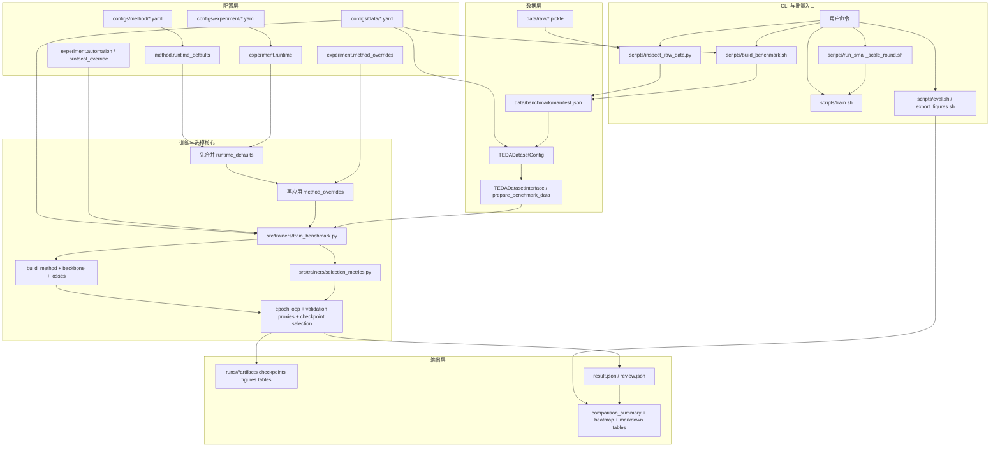

# 领域自适应流程工业故障诊断研究工作区

本工作区用于开展 Tennessee Eastman Process (TEP) 领域自适应故障诊断研究，统一管理数据、实验代码、训练结果和论文材料。当前代码主线面向 single-source to single-target 的流程工业故障诊断 benchmark 复现与方法对比。

## 项目说明

- 研究主题：流程工业故障诊断中的领域自适应。
- 数据集：Tennessee Eastman Process Domain Adaptation，原始 `.pickle` 文件统一放在 `data/raw/`。
- 默认任务设置：single-source、single-target、无监督目标域适配。
- 工作区分工：
  - `src/` 放核心实现。
  - `configs/` 放数据、方法和实验配置。
  - `scripts/` 放命令行入口。
  - `paper/` 放论文模板、正文与图表材料。
  - `external/` 与 `refs/` 放外部参考代码和资料。

## 目录概览

以下目录树为当前仓库的主要结构，用于帮助快速定位入口；不追求逐文件穷举。

```text
workspace/
├─ README.md
├─ WORKFLOW.md
├─ environment.yml
├─ requirements-benchmark.txt
├─ configs/
│  ├─ data/
│  ├─ experiment/
│  └─ method/
├─ data/
│  ├─ raw/
│  ├─ benchmark/
│  └─ cache/
├─ scripts/
│  ├─ common_env.sh
│  ├─ inspect_raw_data.py
│  ├─ build_benchmark.py
│  ├─ build_benchmark.sh
│  ├─ train.sh
│  ├─ eval.sh
│  ├─ export_figures.sh
│  └─ run_small_scale_round.sh
├─ src/
│  ├─ automation/
│  ├─ backbones/
│  ├─ datasets/
│  ├─ evaluation/
│  ├─ losses/
│  ├─ methods/
│  ├─ trainers/
│  └─ utils/
├─ paper/
│  ├─ thesis.tex
│  ├─ chapters/
│  ├─ bib/
│  ├─ figs/
│  ├─ out/
│  └─ resources/
├─ external/
├─ refs/
│  ├─ algorithms/
│  ├─ datasets/
│  ├─ papers/
│  └─ reading/
└─ runs/
```

## 数据与参考区约定

- 原始数据放在 `data/raw/`
  - 预期为 6 个 `.pickle` 文件。
  - 视为不可变上游快照，不要移动、重命名、删除。
- benchmark 元数据和说明文档放在 `data/benchmark/`
  - 例如 `manifest.json`、数据勘察报告等。
  - 当前构建流程只生成小型元数据，不复制原始大数组。
- 缓存和临时产物放在 `data/cache/`。
- `external/` 与 `refs/` 默认视为只读参考区，不应直接在其中开发实验代码。

## 环境准备

```bash
# 1) 创建基础环境
conda env create -f environment.yml

# 2) 激活项目环境（推荐）
conda activate tep_env

# 3) 安装训练 / 评估 / 出图依赖
pip install -r requirements-benchmark.txt
```

- `environment.yml` 只包含基础依赖；训练、评估、导出图表还需要 `requirements-benchmark.txt`。
- `scripts/*.sh` 会优先使用当前激活的 `tep_env`；如果未激活但本机有 `conda`，脚本会自动回退到 `conda run -n tep_env python`。
- 如果只做原始数据勘察和 manifest 构建，基础环境通常就足够；训练、评估、图表导出需要额外的 benchmark 依赖。

## 常用工作流

```bash
# 勘察原始 pickle 的结构，并生成 inspection 报告 / JSON
python scripts/inspect_raw_data.py --config configs/data/te_da.yaml

# 从勘察结果生成 benchmark manifest
bash scripts/build_benchmark.sh configs/data/te_da.yaml

# 训练一个方法
bash scripts/train.sh \
  configs/data/te_da.yaml \
  configs/method/source_only.yaml \
  configs/experiment/quick_debug.yaml

# 例如改成 DANN / CDAN / DeepJDOT
bash scripts/train.sh \
  configs/data/te_da.yaml \
  configs/method/dann.yaml \
  configs/experiment/quick_debug.yaml

# 运行默认的 quick_debug 批量实验（2 场景 x 6 方法 = 12 runs）
bash scripts/run_small_scale_round.sh

# 预览默认 quick_debug 计划而不启动训练
bash scripts/run_small_scale_round.sh --plan-only

# 预览 benchmark_72 计划（12 设置 x 6 方法 = 72 runs）
bash scripts/run_small_scale_round.sh \
  --experiment-config configs/experiment/benchmark_72.yaml \
  --plan-only

# 只跑指定方法和场景做 smoke test
bash scripts/run_small_scale_round.sh \
  --methods source_only \
  --scenes mode1:mode4 \
  --dry-run

# 汇总 runs/ 下的结果
bash scripts/eval.sh runs

# 导出汇总图表与指定 artifact 图
bash scripts/export_figures.sh runs
```

## 当前架构流程



- 配置优先级是：`configs/method/*.yaml` 里的 `runtime_defaults` < `configs/experiment/*.yaml` 里的显式 `runtime` < experiment 里的 `method_overrides`。
- 对 `selection_weights`、`selection_params`、`early_stopping_weights`、`early_stopping_params` 这几类 metric 配置，后层覆盖前层时采用“整块替换”，避免残留旧 metric 的键。
- `selection_metrics.py` 维护可注册的选模 / 早停 score；主训练循环只负责在每个 epoch 产出 summary，然后统一调用 registry。
- 批量脚本只负责展开 `automation` 计划，不在脚本里硬编码方法特判。

## 方法与配置

- 当前提供的方法配置位于 `configs/method/`：
  `source_only`、`coral`、`dan`、`dann`、`cdan`、`deepjdot`。
- 数据配置默认入口为 `configs/data/te_da.yaml`。
- 常用实验配置位于 `configs/experiment/`，包括：
  `quick_debug.yaml`、`benchmark_72.yaml`。
- `run_small_scale_round.sh` 默认读取 experiment 配置里的 `automation` 计划。
- 默认 `quick_debug` 计划会批量运行以下场景：
  `mode1->mode4`、`mode4->mode1`。
- `benchmark_72.yaml` 定义了当前阶段的 72-run 基准计划：
  6 个代表性单源设置 + 6 个五源到单目标设置，再与 6 种方法做笛卡尔展开。
- 各方法的基础参数保留在 `configs/method/*.yaml`；如果某个方法需要默认的运行时策略（例如专属选模 / 早停指标），可在方法配置里声明 `runtime_defaults`，再由 experiment 配置显式覆盖。
- 当前阶段的实验级单独调参入口仍放在 experiment 配置里的 `method_overrides`，其优先级高于方法里的 `runtime_defaults`。
- 当前默认早停 / 选模策略仍使用 `hybrid_source_eval_inverse_entropy`，即将 `source_eval` 与目标域无标签熵代理融合；`source_eval` 仍保留为诊断指标。
- 如果某个注册 metric 还需要额外标量参数，可以在 experiment 或 method 的 `runtime_defaults` 里通过 `selection_params` / `early_stopping_params` 传入，而权重项继续放在 `selection_weights` / `early_stopping_weights`。
- 目前内置的 `hybrid_source_eval_entropy_guard_domain_gap` 适合 adversarial DA 方法：当目标域熵已经异常偏低、但域判别准确率离理想混淆点还较远时，会惩罚这类过度自信 checkpoint。

## Git 追踪说明

当前仓库默认跟踪项目源码与文档，忽略大数据、外部参考和实验输出：

- 已跟踪：`README.md`、`environment.yml`、`requirements-benchmark.txt`、`configs/`、`scripts/`、`src/`、`paper/`
- 默认忽略：`.vscode/`、`data/`、`external/`、`refs/`、`runs/`、缓存与临时文件

## 外部来源链接

以下链接用于记录本项目曾使用过的外部仓库、模板与数据源，便于后续重新 `git clone`、手动下载或回溯来源。

- 原始数据集（Tennessee Eastman Process Domain Adaptation, Kaggle）：
  https://www.kaggle.com/datasets/eddardd/tennessee-eastman-process-domain-adaptation?resource=download
- 论文模板（`paper/` 基于该模板整理）：
  https://github.com/SuikaXhq/seu-bachelor-thesis-2022.git
- `external/tep-domain-adaptation`：
  https://github.com/eddardd/tep-domain-adaptation.git
- `external/TL-Fault-Diagnosis-Library`：
  https://github.com/Feaxure-fresh/TL-Fault-Diagnosis-Library.git
- `external/skada`：
  https://github.com/scikit-adaptation/skada.git
- `refs/algorithms/Deep-Unsupervised-Domain-Adaptation`：
  https://github.com/agrija9/Deep-Unsupervised-Domain-Adaptation.git
- `refs/algorithms/OMEGA`：
  https://github.com/mendicant04/OMEGA.git
- `refs/reading/transferlearning`：
  https://github.com/jindongwang/transferlearning.git
- `refs/reading/awesome-domain-adaptation`：
  https://github.com/zhaoxin94/awesome-domain-adaptation.git
