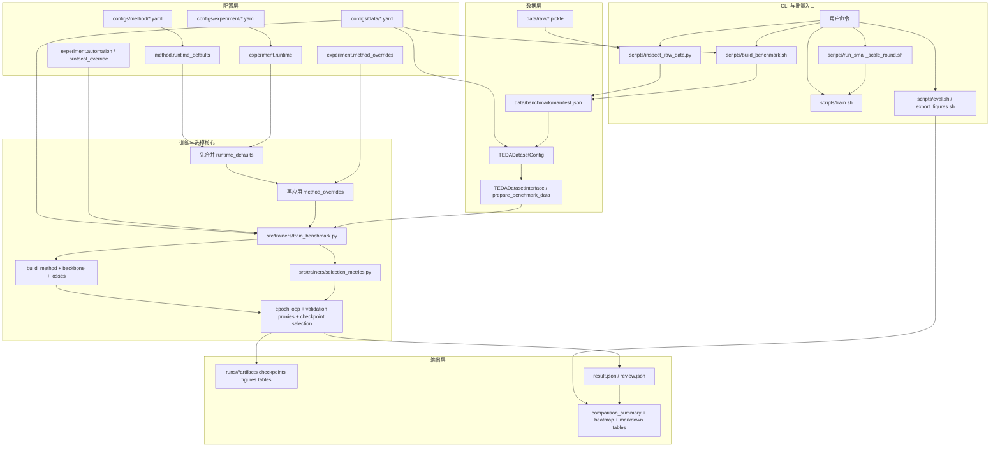

# 领域自适应流程工业故障诊断研究工作区

本工作区用于开展 Tennessee Eastman Process (TEP) 领域自适应故障诊断研究，统一管理数据、实验代码、训练结果和论文材料。当前主线聚焦 `goal.md` 所定义的 RCTA 机制叙事与 `benchmark_72_2clusters_9scenes_8methods_fixedfold.yaml` 的 mode1/2/5 fixed-fold 握手协议：9 个迁移设置、8 种方法，共 72 个主要结果点；论文与实验组织方式以“先稳定、再筛噪、后协同”为核心。

## 项目说明

- 研究主题：流程工业故障诊断中的领域自适应。
- 数据集：Tennessee Eastman Process Domain Adaptation，原始 `.pickle` 文件统一放在 `data/raw/`。
- 默认任务设置：以 mode1、mode2、mode5 三个域之间的握手协议为准，包含 6 个单源到单目标场景与 3 个多源到单目标场景，和 `goal.md` 中的主 benchmark 约定保持一致。
- 当前对比方法：`Target-Only`、`RCTA`、`DeepJDOT`、`CDAN`、`DANN`、`DAN`、`CORAL`、`Source-Only`。
- 当前理想结果：`Target-Only` 维持上界，`RCTA` 完整体稳定处于无监督域适配方法中的第一梯队并整体仅次于 `Target-Only`，`DeepJDOT` 或其他 OT/JDOT 类方法靠前，常规 DA 方法保持合理水平，`Source-Only` 作为无适配下界垫底；整体叙事优先强调机制闭环与递进消融的 `A < A+B < A+B+C`。
- 工作区分工：
  - `src/` 放核心实现。
  - `configs/` 放数据、方法和实验配置。
  - `scripts/` 放命令行入口。
  - `tests/` 放自动化验证。
  - `paper/` 放论文模板、正文与图表材料。
  - `external/` 统一放置通过 `git clone` 获取的开源代码资料库。
  - `refs/` 仅放参考文献、论文、教程或其他相关文档资料。

## 目录概览

以下目录树为当前仓库的主要结构，用于帮助快速定位入口；不追求逐文件穷举。`tests/` 已加入自动化验证目录，当前工作区会优先围绕 `goal.md` 的三大创新点与 mode1/2/5 fixed-fold 主线目标持续收敛。

```text
workspace/
├─ README.md
├─ WORKFLOW.md
├─ goal.md
├─ AGENTS.md
├─ environment.yml
├─ requirements-benchmark.txt
├─ configs/
│  ├─ data/
│  │  └─ te_da.yaml
│  ├─ experiment/
│  │  ├─ quick_debug.yaml
│  │  ├─ benchmark_72.yaml
│  │  ├─ benchmark_56_8scenes_7methods_rcta_best.yaml
│  │  ├─ benchmark_88_2clusters_11scenes_8methods_fixedfold.yaml
│  │  ├─ benchmark_88_11scenes_8methods_randomfold.yaml
│  │  └─ rcta_*.yaml
│  └─ method/
│     ├─ source_only.yaml
│     ├─ target_only.yaml
│     ├─ coral.yaml
│     ├─ dan.yaml
│     ├─ dann.yaml
│     ├─ cdan.yaml
│     ├─ deepjdot.yaml
│     └─ rcta.yaml
├─ data/
│  ├─ raw/
│  ├─ benchmark/
│  └─ cache/
├─ scripts/
│  ├─ common_env.sh
│  ├─ inspect_raw_data.py
│  ├─ build_benchmark.py
│  ├─ build_benchmark.sh
│  ├─ train.sh
│  ├─ eval.sh
│  ├─ export_figures.sh
│  └─ run_small_scale_round.sh
├─ src/
│  ├─ automation/
│  ├─ backbones/
│  ├─ datasets/
│  ├─ evaluation/
│  ├─ losses/
│  ├─ methods/
│  ├─ trainers/
│  └─ utils/
├─ tests/
├─ paper/
│  ├─ thesis.tex
│  ├─ chapters/
│  ├─ bib/
│  ├─ figs/
│  ├─ out/
│  └─ resources/
├─ external/
├─ refs/
│  ├─ algorithms/
│  ├─ datasets/
│  ├─ papers/
│  └─ reading/
└─ runs/
```

## 数据与参考区约定

- 原始数据放在 `data/raw/`
  - 预期为 6 个 `.pickle` 文件。
  - 视为不可变上游快照，不要移动、重命名、删除。
- benchmark 元数据和说明文档放在 `data/benchmark/`
  - 例如 `manifest.json`、数据勘察报告等。
  - 当前构建流程只生成小型元数据，不复制原始大数组。
- 缓存和临时产物放在 `data/cache/`。
  - `data/cache/benchmark_prepared/` 是训练前切分/归一化后的大数组缓存，单个 `.npz` 可能达到数百 MB；当前默认关闭，避免 benchmark 调参时磁盘随轮次膨胀。确需测试缓存收益时，可在 `configs/data/te_da.yaml` 中显式开启 `loading.prepared_cache_enabled: true`。
  - 关闭 prepared cache 后，已有 `data/cache/benchmark_prepared/*.npz` 不会被训练流程继续写入；确认没有训练进程正在读取时，可以安全清理这些旧缓存来回收空间。
- `external/` 默认视为开源代码镜像区，不应在其中直接开发实验代码。
- `refs/` 默认视为文档与文献参考区，不应在其中直接开发实验代码。

## 环境准备

```bash
# 1) 创建基础环境
conda env create -f environment.yml

# 2) 激活项目环境（推荐）
conda activate tep_env

# 3) 安装训练 / 评估 / 出图依赖
pip install -r requirements-benchmark.txt
```

- `environment.yml` 只包含基础依赖；训练、评估、导出图表还需要 `requirements-benchmark.txt`。
- `scripts/*.sh` 会优先使用当前激活的 `tep_env`；如果未激活但本机有 `conda`，脚本会自动回退到 `conda run -n tep_env python`。
- 如果只做原始数据勘察和 manifest 构建，基础环境通常就足够；训练、评估、图表导出需要额外的 benchmark 依赖。

## 常用工作流

```bash
# 勘察原始 pickle 的结构，并生成 inspection 报告 / JSON
python scripts/inspect_raw_data.py --config configs/data/te_da.yaml

# 从勘察结果生成 benchmark manifest
bash scripts/build_benchmark.sh configs/data/te_da.yaml

# 训练一个方法
bash scripts/train.sh \
  configs/data/te_da.yaml \
  configs/method/source_only.yaml \
  configs/experiment/quick_debug.yaml

# 例如改成 DANN / CDAN / DeepJDOT
bash scripts/train.sh \
  configs/data/te_da.yaml \
  configs/method/dann.yaml \
  configs/experiment/quick_debug.yaml

# 运行默认的 quick_debug 批量实验（历史 benchmark 用法，2 场景 x 6 方法 = 12 runs）
bash scripts/run_small_scale_round.sh

# 预览默认 quick_debug 计划而不启动训练
bash scripts/run_small_scale_round.sh --plan-only

# 预览 benchmark_72 计划（历史 benchmark 用法，12 设置 x 6 方法 = 72 runs）
bash scripts/run_small_scale_round.sh \
  --experiment-config configs/experiment/benchmark_72.yaml \
  --plan-only

# 预览当前 mode1/2/5 fixed-fold 主线计划（9 设置 x 8 方法 = 72 runs）
bash scripts/run_small_scale_round.sh \
  --experiment-config configs/experiment/benchmark_88_2clusters_11scenes_8methods_fixedfold.yaml \
  --plan-only

# 预览旧的 RCTA 8 场景 / 7 方法计划
bash scripts/run_small_scale_round.sh \
  --experiment-config configs/experiment/benchmark_56_8scenes_7methods_rcta_best.yaml \
  --plan-only

# 只跑指定方法和场景做 smoke test
bash scripts/run_small_scale_round.sh \
  --methods source_only \
  --scenes mode1:mode4 \
  --dry-run

# 汇总 runs/ 下的结果
bash scripts/eval.sh runs

# 导出汇总图表与指定 artifact 图
bash scripts/export_figures.sh runs
```

## 当前架构流程



- 配置优先级是：`configs/method/*.yaml` 里的 `runtime_defaults` < `configs/experiment/*.yaml` 里的显式 `runtime` < experiment 里的 `method_overrides`。
- 对 `selection_weights`、`selection_params`、`early_stopping_weights`、`early_stopping_params` 这几类 metric 配置，后层覆盖前层时采用“整块替换”，避免残留旧 metric 的键。
- 如果某个方法在激进加速配置下不稳定，也应优先通过 `method_overrides.<method>.runtime` 覆盖 `cudnn_benchmark / num_workers / pin_memory / persistent_workers / non_blocking_transfers`，而不是在训练代码里写特判。
- `selection_metrics.py` 维护可注册的选模 / 早停 score；主训练循环只负责在每个 epoch 产出 summary，然后统一调用 registry。
- 批量脚本只负责展开 `automation` 计划，不在脚本里硬编码方法特判。

## 方法与配置

- 当前提供的方法配置位于 `configs/method/`：
  `source_only`、`target_only`、`coral`、`dan`、`dann`、`cdan`、`deepjdot`、`rcta`。
- 数据配置默认入口为 `configs/data/te_da.yaml`。
- 常用实验配置位于 `configs/experiment/`，包括：
  `quick_debug.yaml`、`benchmark_72.yaml`、`benchmark_56_8scenes_7methods_rcta_best.yaml`、`benchmark_88_2clusters_11scenes_8methods_fixedfold.yaml`。
- `run_small_scale_round.sh` 默认读取 experiment 配置里的 `automation` 计划。
- 默认 `quick_debug` 计划会批量运行以下场景：
  `mode1->mode4`、`mode4->mode1`。
- `benchmark_88_2clusters_11scenes_8methods_fixedfold.yaml` 是当前主线配置：
  mode1/2/5 三个域之间 6 个有向单源设置 + 3 个二源到单目标设置，再与 8 种方法做笛卡尔展开，共 72 runs。
- `benchmark_56_8scenes_7methods_rcta_best.yaml` 保留为旧的 RCTA 稳定性参考配置：
  8 个场景 + 7 种方法，共 56 runs。
- `benchmark_72.yaml` 保留为历史 72-run 基准计划：
  6 个代表性单源设置 + 6 个五源到单目标设置，再与 6 种方法做笛卡尔展开。
- 各方法的基础参数保留在 `configs/method/*.yaml`；如果某个方法需要默认的运行时策略（例如专属选模 / 早停指标），可在方法配置里声明 `runtime_defaults`，再由 experiment 配置显式覆盖。
- 当前阶段的实验级单独调参入口仍放在 experiment 配置里的 `method_overrides`，其优先级高于方法里的 `runtime_defaults`。
- 当前 fixed-fold 主线默认早停 / 选模策略使用 `hybrid_source_eval_target_confidence`，即将 `source_eval` 与目标域无标签置信度代理融合；`source_eval` 仍保留为诊断指标。
- 如果某个注册 metric 还需要额外标量参数，可以在 experiment 或 method 的 `runtime_defaults` 里通过 `selection_params` / `early_stopping_params` 传入，而权重项继续放在 `selection_weights` / `early_stopping_weights`。
- 目前内置的 `hybrid_source_eval_entropy_guard_domain_gap` 适合 adversarial DA 方法：当目标域熵已经异常偏低、但域判别准确率离理想混淆点还较远时，会惩罚这类过度自信 checkpoint。

## Git 追踪说明

当前仓库默认跟踪项目源码与文档，忽略大数据、外部参考和实验输出：

- 已跟踪：`README.md`、`environment.yml`、`requirements-benchmark.txt`、`configs/`、`scripts/`、`src/`、`paper/`
- 默认忽略：`.vscode/`、`data/raw/`、`external/`、`refs/`、`runs/`、缓存与临时文件

## 外部来源链接

以下链接用于记录本项目曾使用过的外部仓库、模板与数据源，便于后续重新 `git clone`、手动下载或回溯来源。

- `external/` 中记录的是可直接 `git clone` 的开源代码仓库。
- `refs/` 中记录的是论文、教程、综述或其他文档类资料。

- 原始数据集（Tennessee Eastman Process Domain Adaptation, Kaggle）：
  https://www.kaggle.com/datasets/eddardd/tennessee-eastman-process-domain-adaptation?resource=download
- 论文模板（`paper/` 基于该模板整理）：
  https://github.com/SuikaXhq/seu-bachelor-thesis-2022.git
- `external/tep-domain-adaptation`：
  https://github.com/eddardd/tep-domain-adaptation.git
- `external/TL-Fault-Diagnosis-Library`：
  https://github.com/Feaxure-fresh/TL-Fault-Diagnosis-Library.git
- `external/Transfer-Learning-Library`：
  https://github.com/thuml/Transfer-Learning-Library.git
- `external/skada`：
  https://github.com/scikit-adaptation/skada.git
- `external/pytorch-adapt`：
  https://github.com/KevinMusgrave/pytorch-adapt.git
- `external/source-free-domain-adaptation`：
  https://github.com/tntek/source-free-domain-adaptation.git
- `external/SDALR`：
  https://github.com/BdLab405/SDALR.git
- `external/SHOT`：
  https://github.com/tim-learn/SHOT.git
- `external/SENTRY`：
  https://github.com/virajprabhu/SENTRY.git
- `external/ProDA`：
  https://github.com/microsoft/ProDA.git
- `external/improved_sfda`：
  https://github.com/nttcslab/improved_sfda.git
- `external/mean-teacher`：
  https://github.com/CuriousAI/mean-teacher.git

- `refs/algorithms/Deep-Unsupervised-Domain-Adaptation`：
  https://github.com/agrija9/Deep-Unsupervised-Domain-Adaptation.git
- `refs/algorithms/OMEGA`：
  https://github.com/mendicant04/OMEGA.git
- `refs/reading/transferlearning`：
  https://github.com/jindongwang/transferlearning.git
- `refs/reading/awesome-domain-adaptation`：
  https://github.com/zhaoxin94/awesome-domain-adaptation.git
