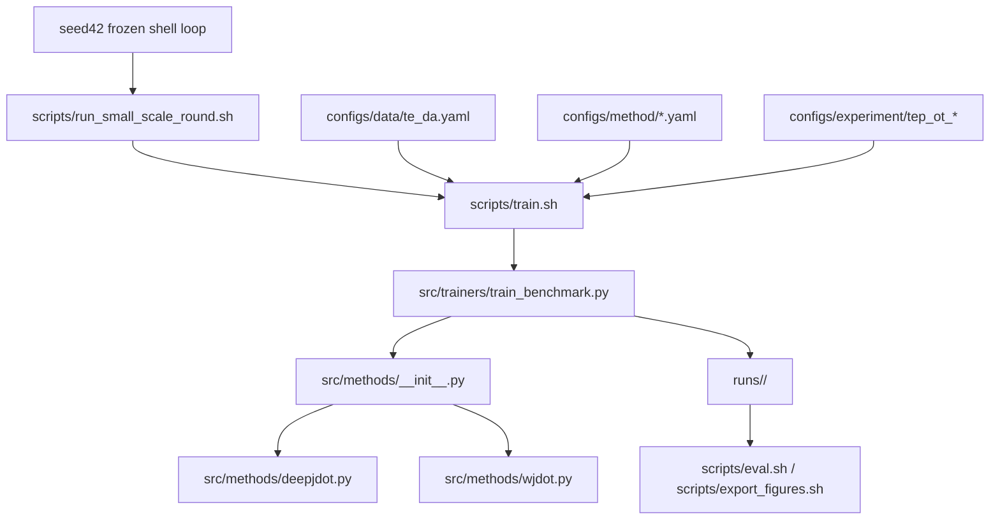

# 领域自适应流程工业故障诊断研究工作区

本工作区用于开展 Tennessee Eastman Process (TEP) 领域自适应故障诊断研究，统一管理数据、实验代码、训练结果和论文材料。当前主线冻结为 2026-05-12 seed42 三实验流程：单源 48、二源 15、五源 30。

当前主线命令：

```bash
set -euo pipefail

SEED=42
DATE_TAG=20260512

SINGLE_CONFIG=configs/experiment/tep_mainline_single_source_6scenes_8methods_dpjdot_cbtpu_anchor.yaml
TWO_SOURCE_CONFIG=configs/experiment/tep_mainline_multisource_2source_3scenes_5methods_ca_ccsr_wjdot_anchor_fusion.yaml
FIVE_SOURCE_CONFIG=configs/experiment/tep_mainline_multisource_5source_6scenes_5methods_ca_ccsr_wjdot_guarded_prior_fusion.yaml

for r in 1 2 3; do
  bash scripts/run_small_scale_round.sh \
    --experiment-config "$SINGLE_CONFIG" \
    --seed "$SEED" \
    --batch-root-name "single_source_8methods_cbtpu_anchor_freeze_r${r}_${DATE_TAG}_seed${SEED}"

  bash scripts/run_small_scale_round.sh \
    --experiment-config "$TWO_SOURCE_CONFIG" \
    --seed "$SEED" \
    --batch-root-name "multisource_ca_ccsr_anchor_fusion_freeze_r${r}_${DATE_TAG}_seed${SEED}"

  bash scripts/run_small_scale_round.sh \
    --experiment-config "$FIVE_SOURCE_CONFIG" \
    --seed "$SEED" \
    --batch-root-name "multisource_30_ca_ccsr_anchor_fusion_freeze_r${r}_${DATE_TAG}_seed${SEED}"
done
```

该流程会依次调用：

- `configs/experiment/tep_mainline_single_source_6scenes_8methods_dpjdot_cbtpu_anchor.yaml`
- `configs/experiment/tep_mainline_multisource_2source_3scenes_5methods_ca_ccsr_wjdot_anchor_fusion.yaml`
- `configs/experiment/tep_mainline_multisource_5source_6scenes_5methods_ca_ccsr_wjdot_guarded_prior_fusion.yaml`

## 项目说明

- 研究主题：流程工业故障诊断中的无监督领域自适应。
- 数据集：Tennessee Eastman Process Domain Adaptation，原始 `.pickle` 文件统一放在 `data/raw/`。
- 当前实验域：mode1、mode2、mode5 及五源多源设置。
- 当前单源创新链：`DeepJDOT -> TPU-DeepJDOT -> CBTPU-DeepJDOT`。
- 当前多源创新线：`CoDATS / WJDOT -> CA-CCSR-WJDOT`。
- 当前监督参考：单源使用 `target_only`，多源使用 `target_ref`；它们只作为上界参考，不作为 UDA 方法排名。

## 当前三条创新方法线

### TPU-DeepJDOT

- 配置：`configs/method/tpu_dpjdot.yaml`
- 实现：`src/methods/deepjdot.py` 中的 `TPUDeepJDOTMethod`
- 机制：非平衡 OT、源类原型 EMA、原型相对代价、时序代价、源域 supervised contrastive warmup。

### CBTPU-DeepJDOT

- 配置：`configs/method/cbtpu_dpjdot.yaml`
- 实现：`src/methods/deepjdot.py` 中的 `CBTPUDeepJDOTMethod`
- 机制：EMA teacher、weak/strong augmentation、`q_ot/q_cls/q_proto` 融合、JS/entropy/confidence 门控、伪标签学习、consistency、logit adjustment。

### CA-CCSR-WJDOT

- 配置：`configs/method/ca_ccsr_wjdot.yaml`
- 实现：`src/methods/wjdot.py` 中的 `CACCSRWJDOTMethod`
- 机制：CoDATS classifier head、domain adversarial alignment、per-source WJDOT、class-source reliability alpha、frozen teacher anchor、teacher-safe fusion、prior-balanced prediction。
- 说明：`ca_ccsr_wjdot` 是当前多源主线代码名；prior-balanced 等细节属于训练配置，不写进方法名。

## 三组主实验

| 实验 | 配置 | 规模 | 主要目的 |
| --- | --- | ---: | --- |
| 单源 48 | `tep_mainline_single_source_6scenes_8methods_dpjdot_cbtpu_anchor.yaml` | 6 场景 x 8 方法 | 验证 DeepJDOT、TPU、CBTPU 的单源递进链 |
| 二源 15 | `tep_mainline_multisource_2source_3scenes_5methods_ca_ccsr_wjdot_anchor_fusion.yaml` | 3 场景 x 5 方法 | 验证二源 CA-CCSR-WJDOT 相对 CoDATS/WJDOT 的收益 |
| 五源 30 | `tep_mainline_multisource_5source_6scenes_5methods_ca_ccsr_wjdot_guarded_prior_fusion.yaml` | 6 场景 x 5 方法 | 验证五源压力测试下 CA-CCSR-WJDOT 的表现边界 |

只预览计划：

```bash
bash scripts/run_small_scale_round.sh \
  --experiment-config configs/experiment/tep_mainline_single_source_6scenes_8methods_dpjdot_cbtpu_anchor.yaml \
  --seed 42 \
  --plan-only
```

## 目录概览

```text
workspace/
├─ README.md
├─ environment.yml
├─ requirements-benchmark.txt
├─ configs/
│  ├─ data/
│  │  └─ te_da.yaml
│  ├─ experiment/
│  │  ├─ tep_mainline_single_source_6scenes_8methods_dpjdot_cbtpu_anchor.yaml
│  │  ├─ tep_mainline_multisource_2source_3scenes_5methods_ca_ccsr_wjdot_anchor_fusion.yaml
│  │  └─ tep_mainline_multisource_5source_6scenes_5methods_ca_ccsr_wjdot_guarded_prior_fusion.yaml
│  └─ method/
│     ├─ source_only.yaml
│     ├─ target_only.yaml
│     ├─ target_ref.yaml
│     ├─ deepjdot.yaml
│     ├─ tpu_dpjdot.yaml
│     ├─ cbtpu_dpjdot.yaml
│     ├─ codats.yaml
│     ├─ wjdot.yaml
│     └─ ca_ccsr_wjdot.yaml
├─ data/
├─ scripts/
├─ src/
├─ paper/
└─ runs/
```

## 环境准备

```bash
conda env create -f environment.yml
conda activate tep_env
pip install -r requirements-benchmark.txt
```

训练、评估、出图和测试默认使用 `tep_env`。如果当前 shell 未激活该环境，优先使用：

```bash
conda run -n tep_env python ...
```

项目脚本会通过 `scripts/common_env.sh` 自动解析环境。

## 常用命令

单次训练：

```bash
bash scripts/train.sh \
  configs/data/te_da.yaml \
  configs/method/tpu_dpjdot.yaml \
  configs/experiment/tep_mainline_single_source_6scenes_8methods_dpjdot_cbtpu_anchor.yaml
```

当前主线批量实验请使用本文开头的 seed42 冻结三主线命令。

结果汇总：

```bash
bash scripts/eval.sh runs
```

图表导出：

```bash
bash scripts/export_figures.sh runs
```

主线 contract 验证：

```bash
conda run -n tep_env python scripts/verify_mainline_contract.py \
  --single-root runs/<single_source_batch> \
  --multi-root runs/<multi_source_batch> \
  --print-tables
```

## 当前架构流程


```mermaid
flowchart TD
  CLI[seed42 frozen shell loop] --> AUTO[scripts/run_small_scale_round.sh]
  AUTO --> TRAIN[scripts/train.sh]
  CFG1[configs/data/te_da.yaml] --> TRAIN
  CFG2[configs/method/*.yaml] --> TRAIN
  CFG3[configs/experiment/tep_ot_*] --> TRAIN
  TRAIN --> CORE[src/trainers/train_benchmark.py]
  CORE --> REG[src/methods/__init__.py]
  REG --> DJ[src/methods/deepjdot.py]
  REG --> WJ[src/methods/wjdot.py]
  CORE --> OUT[runs/<batch>/<run>]
  OUT --> EVAL[scripts/eval.sh / scripts/export_figures.sh]
```

配置优先级：

1. `configs/method/*.yaml` 中的基础方法参数和 `runtime_defaults`
2. `configs/experiment/*.yaml` 中的实验级 `runtime`
3. `configs/experiment/*.yaml` 中的 `method_overrides`

## 判读原则

- 单源 48 主要看 `deepjdot`、`tpu_dpjdot`、`cbtpu_dpjdot` 的均值趋势和逐场景链条。
- 二源 15 和五源 30 主要看 `ca_ccsr_wjdot` 相对 `codats`、`wjdot` 的收益。
- `target_only` / `target_ref` 是监督参考上界，不参与 UDA 排名。
- 不把当前真实结果改写成不真实的完美排序；失败场景保留诊断。
- 若需要补强，优先补跑目标方法的合理配置变体，不重跑全部 baseline。

## Git 追踪说明

当前仓库默认跟踪项目源码与文档，忽略大数据、外部参考和实验输出：

- 已跟踪：`README.md`、`environment.yml`、`requirements-benchmark.txt`、`configs/`、`scripts/`、`src/`、`paper/`
- 默认忽略：`.vscode/`、`data/`、`external/`、`refs/`、`runs/`、`tests/`、`paper/notes/`、缓存与临时文件

## 外部来源链接

- 原始数据集：Tennessee Eastman Process Domain Adaptation  
  https://www.kaggle.com/datasets/eddardd/tennessee-eastman-process-domain-adaptation?resource=download
- 论文模板：  
  https://github.com/SuikaXhq/seu-bachelor-thesis-2022.git
- TEP DA 参考仓库：  
  https://github.com/eddardd/tep-domain-adaptation.git
- Transfer Learning Library：  
  https://github.com/thuml/Transfer-Learning-Library.git
- skada：  
  https://github.com/scikit-adaptation/skada.git
