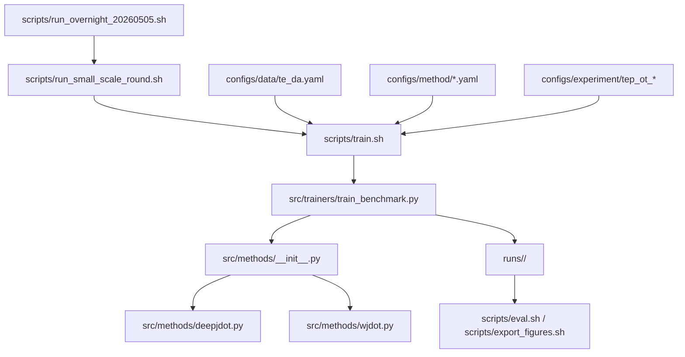

# 领域自适应流程工业故障诊断研究工作区

本工作区用于开展 Tennessee Eastman Process (TEP) 领域自适应故障诊断研究，统一管理数据、实验代码、训练结果和论文材料。当前主线已经切换为 2026-05-06 overnight 三实验流程：单源 48、多源 15、多源 30。

当前主线命令：

```bash
RUN_TAG=overnight_20260506_seed42 ROUNDS=3 SEEDS="42 42 42" \
bash scripts/run_overnight_20260505.sh
```

该脚本会依次调用：

- `configs/experiment/tep_ot_single_source_8methods_stage1_fold0_overnight_20260505.yaml`
- `configs/experiment/tep_ot_multisource_ca_ccsr_wjdot_stage1_probe_fold0.yaml`
- `configs/experiment/tep_ot_multisource_5source_prior20_overnight_20260505.yaml`

## 项目说明

- 研究主题：流程工业故障诊断中的无监督领域自适应。
- 数据集：Tennessee Eastman Process Domain Adaptation，原始 `.pickle` 文件统一放在 `data/raw/`。
- 当前实验域：mode1、mode2、mode5 及五源多源设置。
- 当前单源创新链：`DeepJDOT -> TPU-DeepJDOT -> CBTPU-DeepJDOT`。
- 当前多源创新线：`CoDATS / WJDOT -> CA-CCSR-WJDOT Prior20`。
- 当前监督参考：单源使用 `target_only`，多源使用 `target_ref`；它们只作为上界参考，不作为 UDA 方法排名。

## 当前三条创新方法线

### TPU-DeepJDOT

- 配置：`configs/method/tpu_deepjdot.yaml`
- 实现：`src/methods/deepjdot.py` 中的 `TPUDeepJDOTMethod`
- 机制：非平衡 OT、源类原型 EMA、原型相对代价、时序代价、源域 supervised contrastive warmup。

### CBTPU-DeepJDOT

- 配置：`configs/method/cbtpu_deepjdot.yaml`
- 实现：`src/methods/deepjdot.py` 中的 `CBTPUDeepJDOTMethod`
- 机制：EMA teacher、weak/strong augmentation、`q_ot/q_cls/q_proto` 融合、JS/entropy/confidence 门控、伪标签学习、consistency、logit adjustment。

### CA-CCSR-WJDOT Prior20

- 配置：`configs/method/ca_ccsr_wjdot_prior20.yaml`
- 实现：`src/methods/wjdot.py` 中的 `CACCSRWJDOTMethod`
- 机制：CoDATS classifier head、domain adversarial alignment、per-source WJDOT、class-source reliability alpha、frozen teacher anchor、teacher-safe fusion、prior-balanced prediction。
- 说明：`prior20` 是 CA-CCSR-WJDOT 的当前主实验配置，不是独立算法类。

## 三组主实验

| 实验 | 配置 | 规模 | 主要目的 |
| --- | --- | ---: | --- |
| 单源 48 | `tep_ot_single_source_8methods_stage1_fold0_overnight_20260505.yaml` | 6 场景 x 8 方法 | 验证 DeepJDOT、TPU、CBTPU 的单源递进链 |
| 多源 15 | `tep_ot_multisource_ca_ccsr_wjdot_stage1_probe_fold0.yaml` | 3 场景 x 5 方法 | 验证二源 CA-CCSR-WJDOT 相对 CoDATS/WJDOT 的收益 |
| 多源 30 | `tep_ot_multisource_5source_prior20_overnight_20260505.yaml` | 6 场景 x 5 方法 | 验证五源压力测试下 CA-CCSR-WJDOT 的表现边界 |

`scripts/run_overnight_20260505.sh` 默认 `ROUNDS=3`。当前推荐固定 seed 重复复现：

```bash
RUN_TAG=overnight_20260506_seed42 ROUNDS=3 SEEDS="42 42 42" \
bash scripts/run_overnight_20260505.sh
```

只预览计划：

```bash
PLAN_ONLY=1 RUN_TAG=overnight_20260506_seed42 ROUNDS=3 SEEDS="42 42 42" \
bash scripts/run_overnight_20260505.sh
```

## 目录概览

```text
workspace/
├─ README.md
├─ WORKFLOW.md
├─ goal.md
├─ AGENTS.md
├─ environment.yml
├─ requirements-benchmark.txt
├─ configs/
│  ├─ data/
│  │  └─ te_da.yaml
│  ├─ experiment/
│  │  ├─ tep_ot_single_source_8methods_stage1_fold0.yaml
│  │  ├─ tep_ot_single_source_8methods_stage1_fold0_overnight_20260505.yaml
│  │  ├─ tep_ot_single_source_tpu_stage1_fold0.yaml
│  │  ├─ tep_ot_multisource_ca_ccsr_wjdot_stage1_probe_fold0.yaml
│  │  └─ tep_ot_multisource_5source_prior20_overnight_20260505.yaml
│  └─ method/
│     ├─ source_only.yaml
│     ├─ target_only.yaml
│     ├─ target_ref.yaml
│     ├─ deepjdot.yaml
│     ├─ tpu_deepjdot.yaml
│     ├─ cbtpu_deepjdot.yaml
│     ├─ codats.yaml
│     ├─ wjdot.yaml
│     └─ ca_ccsr_wjdot_prior20.yaml
├─ data/
├─ scripts/
├─ src/
├─ tests/
├─ paper/
└─ runs/
```

## 环境准备

```bash
conda env create -f environment.yml
conda activate tep_env
pip install -r requirements-benchmark.txt
```

训练、评估、出图和测试默认使用 `tep_env`。如果当前 shell 未激活该环境，优先使用：

```bash
conda run -n tep_env python ...
```

项目脚本会通过 `scripts/common_env.sh` 自动解析环境。

## 常用命令

单次训练：

```bash
bash scripts/train.sh \
  configs/data/te_da.yaml \
  configs/method/tpu_deepjdot.yaml \
  configs/experiment/tep_ot_single_source_tpu_stage1_fold0.yaml
```

当前主线批量实验：

```bash
RUN_TAG=overnight_20260506_seed42 ROUNDS=3 SEEDS="42 42 42" \
bash scripts/run_overnight_20260505.sh
```

结果汇总：

```bash
bash scripts/eval.sh runs
```

图表导出：

```bash
bash scripts/export_figures.sh runs
```

顺序诊断：

```bash
conda run -n tep_env python scripts/diagnose_experiment_ordering.py \
  --runs-root runs \
  --output-dir runs/order_diagnostics_20260506_seed42
```

测试：

```bash
conda run -n tep_env python -m unittest tests.test_train_benchmark -q
conda run -n tep_env python -m unittest tests.test_deepjdot tests.test_wjdot_methods tests.test_no_target_label_leakage -q
```

## 当前架构流程


```mermaid
flowchart TD
  CLI[scripts/run_overnight_20260505.sh] --> AUTO[scripts/run_small_scale_round.sh]
  AUTO --> TRAIN[scripts/train.sh]
  CFG1[configs/data/te_da.yaml] --> TRAIN
  CFG2[configs/method/*.yaml] --> TRAIN
  CFG3[configs/experiment/tep_ot_*] --> TRAIN
  TRAIN --> CORE[src/trainers/train_benchmark.py]
  CORE --> REG[src/methods/__init__.py]
  REG --> DJ[src/methods/deepjdot.py]
  REG --> WJ[src/methods/wjdot.py]
  CORE --> OUT[runs/<batch>/<run>]
  OUT --> EVAL[scripts/eval.sh / scripts/export_figures.sh]
```

配置优先级：

1. `configs/method/*.yaml` 中的基础方法参数和 `runtime_defaults`
2. `configs/experiment/*.yaml` 中的实验级 `runtime`
3. `configs/experiment/*.yaml` 中的 `method_overrides`

## 判读原则

- 单源 48 主要看 `deepjdot`、`tpu_deepjdot`、`cbtpu_deepjdot` 的均值趋势和逐场景链条。
- 多源 15 和多源 30 主要看 `ca_ccsr_wjdot_prior20` 相对 `codats`、`wjdot` 的收益。
- `target_only` / `target_ref` 是监督参考上界，不参与 UDA 排名。
- 不把当前真实结果改写成不真实的完美排序；失败场景保留诊断。
- 若需要补强，优先补跑目标方法的合理配置变体，不重跑全部 baseline。

## Git 追踪说明

当前仓库默认跟踪项目源码与文档，忽略大数据、外部参考和实验输出：

- 已跟踪：`README.md`、`environment.yml`、`requirements-benchmark.txt`、`configs/`、`scripts/`、`src/`、`tests/`、`paper/`
- 默认忽略：`.vscode/`、`data/raw/`、`external/`、`refs/`、`runs/`、缓存与临时文件

## 外部来源链接

- 原始数据集：Tennessee Eastman Process Domain Adaptation  
  https://www.kaggle.com/datasets/eddardd/tennessee-eastman-process-domain-adaptation?resource=download
- 论文模板：  
  https://github.com/SuikaXhq/seu-bachelor-thesis-2022.git
- TEP DA 参考仓库：  
  https://github.com/eddardd/tep-domain-adaptation.git
- Transfer Learning Library：  
  https://github.com/thuml/Transfer-Learning-Library.git
- skada：  
  https://github.com/scikit-adaptation/skada.git
