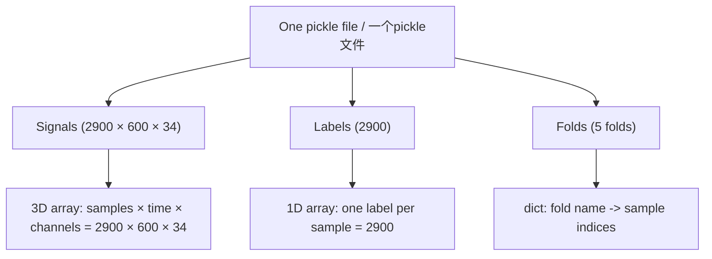
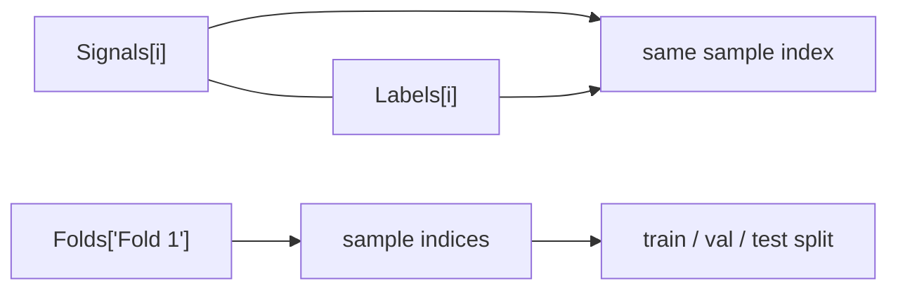
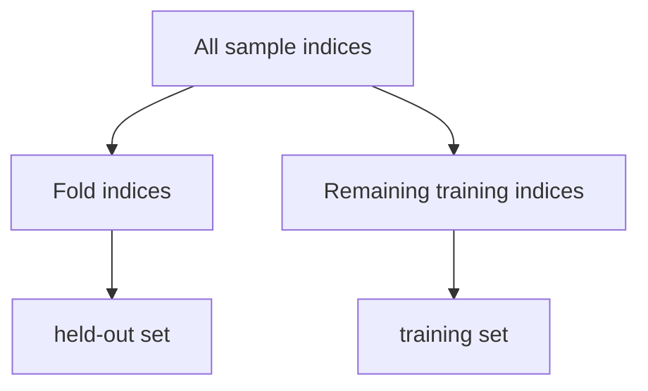

# TE Raw Data Inspection / TE 原始数据检查

Generated / 生成时间: `2026-04-15T08:23:12.117047+00:00`
Raw dir / 原始数据目录: `/home/chenk/workspace/seu_undergraduate_final_year_project/data/raw`

## What is inside one `.pickle`? / 一个 `.pickle` 里有什么？



## Counts and dimensions / 数量与维度

- Signals count / Signals 数量: `2900` samples
- One signal shape / 单个 signal 的形状: `600 × 34`
- Labels count / Labels 数量: `2900` labels
- Folds count / Fold 数量: `5`
- Each fold stores sample indices / 每个 fold 存样本索引: yes

## Three examples / 三个小例子

### 1) Signals example / Signals 示例

```json
{
  "python_type": "ndarray",
  "shape": [
    2900,
    600,
    34
  ],
  "dtype": "float64",
  "example": [
    0.27340836062513607,
    3649.578911978572,
    4442.412731566823
  ]
}
```

### 2) Labels example / Labels 示例

```json
{
  "python_type": "ndarray",
  "shape": [
    2900
  ],
  "dtype": "int64",
  "example": [
    12,
    2,
    12
  ]
}
```

### 3) Folds example / Folds 示例 (Fold 1)

```json
{
  "Fold 1": {
    "python_type": "ndarray",
    "shape": [
      580
    ],
    "dtype": "int64",
    "example": [
      1243,
      2620,
      1581
    ]
  }
}
```

## How to read them / 怎么理解





## Your understanding / 你的理解记录

- One sample is a `600 × 34` matrix / 一个 sample 是 `600 × 34` 的矩阵。
- There are about `2900` such samples / 大约有 `2900` 个这样的 sample。
- If time is concatenated continuously, the dataset can be seen as `34 × (600 × 2900)` over the time axis / 如果把时间连续拼接，整个数据集可理解为沿时间轴的 `34 × (600 × 2900)` 二维形式。
- The raw data is now segmented into `2900` samples / 原始数据现在被切成了 `2900` 份样本。
- Each fold has about `2900 / 5 = 580` samples / 每个 fold 大约有 `2900 / 5 = 580` 个 sample。
- Fold membership is not sequential slicing / fold 不是按顺序切片。
- Sample IDs are randomly assigned into folds, for example a fold may contain a mixed set of sample indices instead of `1-580`, `581-1160`, ... / sample 编号是随机分配到各个 fold 中的，不是按 `1-580`、`581-1160` 这样的连续区间。
- `Folds` therefore store sample index sets, not raw signals / 因此 `Folds` 存的是样本索引集合，而不是原始信号。

## Notes / 备注

- `Signals` 是样本本体 / `Signals` is the sample tensor.
- `Labels` 与样本一一对齐 / `Labels` aligns with `Signals` by index.
- `Folds` 存的是索引，不是原始信号 / `Folds` stores indices, not raw signals.
