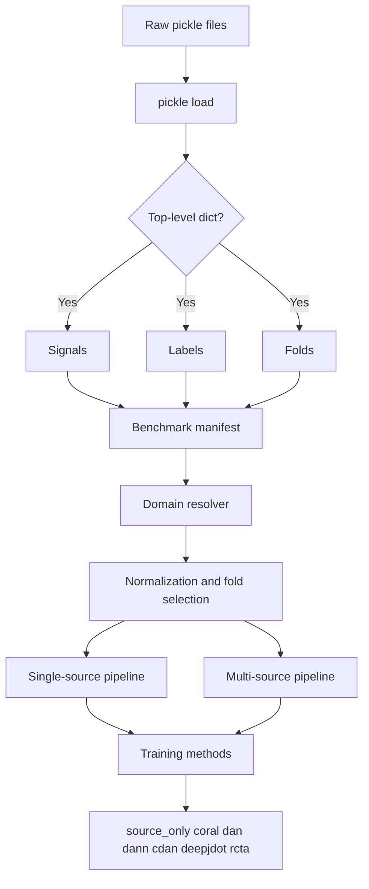
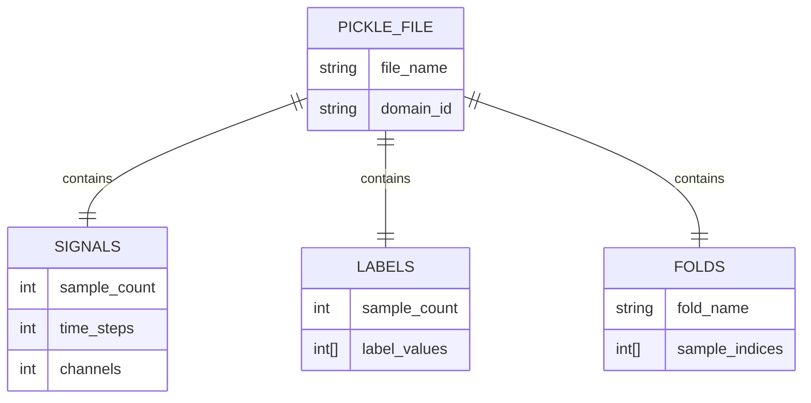

# TE Raw Data Inspection / TE 原始数据检查

Generated at / 生成时间: `2026-04-15T07:13:12.724567+00:00`
Raw dir / 原始数据目录: `/home/chenk/workspace/seu_undergraduate_final_year_project/data/raw`

## File Summary / 文件汇总

| File / 文件 | Domain / 域 | Type / 类型 | Top-level keys / 顶层键 | Error / 错误 |
| --- | --- | --- | --- | --- |
| TEPDataset_Mode1.pickle | mode1 | dict | Signals, Labels, Folds | None |
| TEPDataset_Mode2.pickle | mode2 | dict | Signals, Labels, Folds | None |
| TEPDataset_Mode3.pickle | mode3 | dict | Signals, Labels, Folds | None |
| TEPDataset_Mode4.pickle | mode4 | dict | Signals, Labels, Folds | None |
| TEPDataset_Mode5.pickle | mode5 | dict | Signals, Labels, Folds | None |
| TEPDataset_Mode6.pickle | mode6 | dict | Signals, Labels, Folds | None |

## TEPDataset_Mode1.pickle / 文件详情

- Domain ID / 域编号: `mode1`
- Source path / 源路径: `raw/TEPDataset_Mode1.pickle`
- Size (bytes) / 文件大小(字节): `473326883`
- Python type / Python类型: `dict`
- Required keys present / 必需键是否存在: `{'Signals': True, 'Labels': True, 'Folds': True}`

| Key / 键 | Type / 类型 | Shape / 形状 | Length / 长度 | Dtype / 数据类型 | Extra / 额外信息 |
| --- | --- | --- | --- | --- | --- |
| Signals | ndarray | [2900, 600, 34] | 2900 | float64 | None |
| Labels | ndarray | [2900] | 2900 | int64 | None |
| Folds | dict | None | 5 | None | fold_names=['Fold 1', 'Fold 2', 'Fold 3', 'Fold 4', 'Fold 5']; fold_count=5 |

| Fold | Shape | Length | Dtype | Index range |
| --- | --- | --- | --- | --- |
| Fold 1 | [580] | 580 | int64 | {'size': 580, 'min': 22, 'max': 2896} |
| Fold 2 | [580] | 580 | int64 | {'size': 580, 'min': 9, 'max': 2898} |
| Fold 3 | [580] | 580 | int64 | {'size': 580, 'min': 4, 'max': 2899} |
| Fold 4 | [580] | 580 | int64 | {'size': 580, 'min': 1, 'max': 2895} |
| Fold 5 | [580] | 580 | int64 | {'size': 580, 'min': 0, 'max': 2887} |

## TEPDataset_Mode2.pickle / 文件详情

- Domain ID / 域编号: `mode2`
- Source path / 源路径: `raw/TEPDataset_Mode2.pickle`
- Size (bytes) / 文件大小(字节): `464349923`
- Python type / Python类型: `dict`
- Required keys present / 必需键是否存在: `{'Signals': True, 'Labels': True, 'Folds': True}`

| Key / 键 | Type / 类型 | Shape / 形状 | Length / 长度 | Dtype / 数据类型 | Extra / 额外信息 |
| --- | --- | --- | --- | --- | --- |
| Signals | ndarray | [2845, 600, 34] | 2845 | float64 | None |
| Labels | ndarray | [2845] | 2845 | int64 | None |
| Folds | dict | None | 5 | None | fold_names=['Fold 1', 'Fold 2', 'Fold 3', 'Fold 4', 'Fold 5']; fold_count=5 |

| Fold | Shape | Length | Dtype | Index range |
| --- | --- | --- | --- | --- |
| Fold 1 | [567] | 567 | int64 | {'size': 567, 'min': 1, 'max': 2841} |
| Fold 2 | [567] | 567 | int64 | {'size': 567, 'min': 0, 'max': 2843} |
| Fold 3 | [567] | 567 | int64 | {'size': 567, 'min': 10, 'max': 2840} |
| Fold 4 | [567] | 567 | int64 | {'size': 567, 'min': 5, 'max': 2836} |
| Fold 5 | [567] | 567 | int64 | {'size': 567, 'min': 6, 'max': 2844} |

## TEPDataset_Mode3.pickle / 文件详情

- Domain ID / 域编号: `mode3`
- Source path / 源路径: `raw/TEPDataset_Mode3.pickle`
- Size (bytes) / 文件大小(字节): `473163635`
- Python type / Python类型: `dict`
- Required keys present / 必需键是否存在: `{'Signals': True, 'Labels': True, 'Folds': True}`

| Key / 键 | Type / 类型 | Shape / 形状 | Length / 长度 | Dtype / 数据类型 | Extra / 额外信息 |
| --- | --- | --- | --- | --- | --- |
| Signals | ndarray | [2899, 600, 34] | 2899 | float64 | None |
| Labels | ndarray | [2899] | 2899 | int64 | None |
| Folds | dict | None | 5 | None | fold_names=['Fold 1', 'Fold 2', 'Fold 3', 'Fold 4', 'Fold 5']; fold_count=5 |

| Fold | Shape | Length | Dtype | Index range |
| --- | --- | --- | --- | --- |
| Fold 1 | [579] | 579 | int64 | {'size': 579, 'min': 0, 'max': 2897} |
| Fold 2 | [579] | 579 | int64 | {'size': 579, 'min': 5, 'max': 2896} |
| Fold 3 | [579] | 579 | int64 | {'size': 579, 'min': 2, 'max': 2898} |
| Fold 4 | [579] | 579 | int64 | {'size': 579, 'min': 3, 'max': 2894} |
| Fold 5 | [579] | 579 | int64 | {'size': 579, 'min': 1, 'max': 2893} |

## TEPDataset_Mode4.pickle / 文件详情

- Domain ID / 域编号: `mode4`
- Source path / 源路径: `raw/TEPDataset_Mode4.pickle`
- Size (bytes) / 文件大小(字节): `467614243`
- Python type / Python类型: `dict`
- Required keys present / 必需键是否存在: `{'Signals': True, 'Labels': True, 'Folds': True}`

| Key / 键 | Type / 类型 | Shape / 形状 | Length / 长度 | Dtype / 数据类型 | Extra / 额外信息 |
| --- | --- | --- | --- | --- | --- |
| Signals | ndarray | [2865, 600, 34] | 2865 | float64 | None |
| Labels | ndarray | [2865] | 2865 | int64 | None |
| Folds | dict | None | 5 | None | fold_names=['Fold 1', 'Fold 2', 'Fold 3', 'Fold 4', 'Fold 5']; fold_count=5 |

| Fold | Shape | Length | Dtype | Index range |
| --- | --- | --- | --- | --- |
| Fold 1 | [571] | 571 | int64 | {'size': 571, 'min': 2, 'max': 2861} |
| Fold 2 | [571] | 571 | int64 | {'size': 571, 'min': 4, 'max': 2848} |
| Fold 3 | [571] | 571 | int64 | {'size': 571, 'min': 10, 'max': 2864} |
| Fold 4 | [571] | 571 | int64 | {'size': 571, 'min': 0, 'max': 2853} |
| Fold 5 | [571] | 571 | int64 | {'size': 571, 'min': 1, 'max': 2862} |

## TEPDataset_Mode5.pickle / 文件详情

- Domain ID / 域编号: `mode5`
- Source path / 源路径: `raw/TEPDataset_Mode5.pickle`
- Size (bytes) / 文件大小(字节): `470552187`
- Python type / Python类型: `dict`
- Required keys present / 必需键是否存在: `{'Signals': True, 'Labels': True, 'Folds': True}`

| Key / 键 | Type / 类型 | Shape / 形状 | Length / 长度 | Dtype / 数据类型 | Extra / 额外信息 |
| --- | --- | --- | --- | --- | --- |
| Signals | ndarray | [2883, 600, 34] | 2883 | float64 | None |
| Labels | ndarray | [2883] | 2883 | int64 | None |
| Folds | dict | None | 5 | None | fold_names=['Fold 1', 'Fold 2', 'Fold 3', 'Fold 4', 'Fold 5']; fold_count=5 |

| Fold | Shape | Length | Dtype | Index range |
| --- | --- | --- | --- | --- |
| Fold 1 | [576] | 576 | int64 | {'size': 576, 'min': 0, 'max': 2881} |
| Fold 2 | [576] | 576 | int64 | {'size': 576, 'min': 7, 'max': 2882} |
| Fold 3 | [576] | 576 | int64 | {'size': 576, 'min': 2, 'max': 2880} |
| Fold 4 | [576] | 576 | int64 | {'size': 576, 'min': 1, 'max': 2878} |
| Fold 5 | [576] | 576 | int64 | {'size': 576, 'min': 8, 'max': 2869} |

## TEPDataset_Mode6.pickle / 文件详情

- Domain ID / 域编号: `mode6`
- Source path / 源路径: `raw/TEPDataset_Mode6.pickle`
- Size (bytes) / 文件大小(字节): `472837219`
- Python type / Python类型: `dict`
- Required keys present / 必需键是否存在: `{'Signals': True, 'Labels': True, 'Folds': True}`

| Key / 键 | Type / 类型 | Shape / 形状 | Length / 长度 | Dtype / 数据类型 | Extra / 额外信息 |
| --- | --- | --- | --- | --- | --- |
| Signals | ndarray | [2897, 600, 34] | 2897 | float64 | None |
| Labels | ndarray | [2897] | 2897 | int64 | None |
| Folds | dict | None | 5 | None | fold_names=['Fold 1', 'Fold 2', 'Fold 3', 'Fold 4', 'Fold 5']; fold_count=5 |

| Fold | Shape | Length | Dtype | Index range |
| --- | --- | --- | --- | --- |
| Fold 1 | [579] | 579 | int64 | {'size': 579, 'min': 0, 'max': 2893} |
| Fold 2 | [579] | 579 | int64 | {'size': 579, 'min': 2, 'max': 2895} |
| Fold 3 | [579] | 579 | int64 | {'size': 579, 'min': 1, 'max': 2891} |
| Fold 4 | [579] | 579 | int64 | {'size': 579, 'min': 21, 'max': 2892} |
| Fold 5 | [579] | 579 | int64 | {'size': 579, 'min': 5, 'max': 2896} |

## Mermaid overview / 流程总览

## Raw data structure explained / 原始数据结构说明

