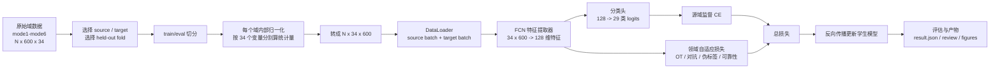
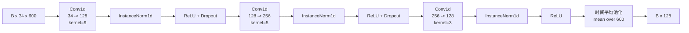
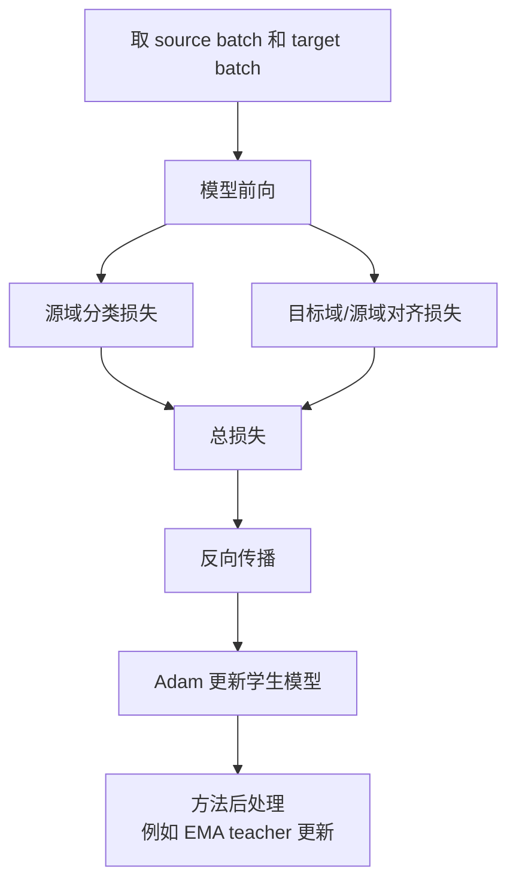
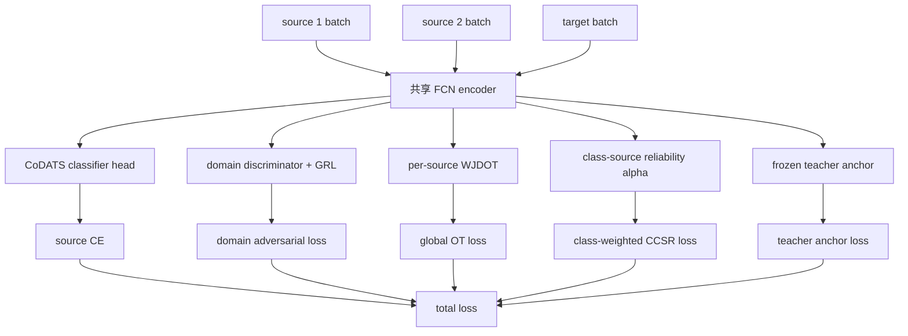
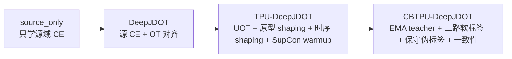
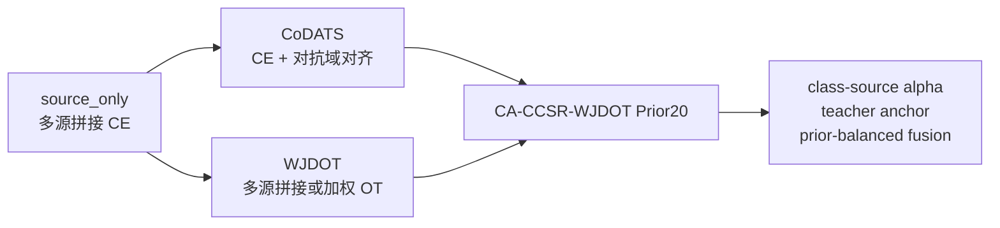

# 项目主骨架与主线方法计算原理

本文档用于解释当前工作区中主线实验“到底怎么算”，而不是解释代码怎么写。

适用范围：

- 数据：Tennessee Eastman Process Domain Adaptation，6 个工况域 `mode1` 到 `mode6`。
- 输入样本：每条样本为 `600` 个时间步、`34` 个变量。
- 标签：29 类，代码中按 `0` 到 `28` 处理。
- 训练主线：单源 DeepJDOT 系列，多源 CoDATS/WJDOT/CA-CCSR-WJDOT 系列。
- 本文档只描述当前代码真实接通的计算路径。没有接入训练入口的想法、旧叙事、论文概念不在这里展开。

阅读方式：

- 先看第 1 到第 4 节，建立“数据如何变成损失”的主骨架。
- 再看第 5 到第 9 节，理解各方法只是在同一骨架上替换或增加损失项。
- 如果某个符号或步骤不懂，后续就在这份文档上继续补充。

---

## 0. 一个总图



核心问题：

> 源域有标签，目标域训练时没有标签。模型必须利用目标域的无标签信号分布，学到能跨工况泛化的故障特征。

---

## 1. 数据阶段：从 pickle 到训练 batch

### 1.1 原始数据的数学形状

每个工况域记为：

```text
D_k = {X_k, y_k, F_k}
```

其中：

- `k` 是工况域编号，例如 `mode1`。
- `X_k` 的形状约为 `N_k x 600 x 34`。
- `y_k` 的形状为 `N_k`，每个值属于 `0..28`。
- `F_k` 是 5 个 fold 的索引集合。

一条样本可以理解成矩阵：

```text
x_i ∈ R^(600 x 34)
```

行是时间步，列是变量。

这里的 `600` 在当前工作区中只能严格解释为：

```text
600 个采样点 / 600 个离散时间步 / 长度为 600 的时间窗口
```

不能直接写成 `600 秒`，除非原始数据集说明每个采样间隔正好是 1 秒。当前训练代码完全把它当作序列长度处理，只关心第 1 步到第 600 步之间的相对时序模式，不使用真实物理时间单位。

### 1.2 fold 切分

一次实验会指定源域和目标域，例如：

```text
source = mode1
target = mode5
fold = Fold 1
```

对每个参与域都做同样的 held-out fold 切分：

```text
eval_indices = Fold 1 中的索引
train_indices = 该域全部索引 - eval_indices
```

因此：

- 源域 train：训练时使用信号和标签。
- 源域 eval：用于源域验证和选模指标。
- 目标域 train：无监督适配时只使用信号，标签被置为 `-1`。
- 目标域 eval：训练后评价用，标签只用于算最终指标和诊断表。

`target_only` 和 `target_ref` 是例外：它们会打开目标域训练标签，只作为监督参考上界。

### 1.3 归一化

当前数据配置是：

```text
normalization = standardization
normalization_scope = domain
channels_first = true
```

含义是：每个工况域单独归一化，不把 6 个域混在一起算统计量。

对某个域 `D_k`，第 `c` 个变量的均值和标准差按该域全部样本、全部时间步计算：

```text
mu_c = mean over all samples and all time steps of variable c
sigma_c = std over all samples and all time steps of variable c
```

然后对每个值做：

```text
x'[:, :, c] = (x[:, :, c] - mu_c) / sigma_c
```

如果某个变量标准差接近 0，代码不会除以 0，而是退化成用均值或 1 做分母。

这个选择的直觉是：

> 先消除每个工况内部的量纲和尺度差异，再让模型学习“故障造成的相对波动模式”。

### 1.4 维度转置

原始样本通常是：

```text
N x 600 x 34
```

训练前转成：

```text
N x 34 x 600
```

原因是 1D 卷积把 `34` 个变量当作通道，把 `600` 个采样点当作时间轴。

可以把一条样本先想成一张表：

```text
原始排法: 600 x 34

             变量1   变量2   ...   变量34
时间步1       x11    x12          x1,34
时间步2       x21    x22          x2,34
...
时间步600     x600,1 ...          x600,34
```

这个排法很适合人读：每一行是一个时刻，每一列是一个过程变量。

但 PyTorch 的 `Conv1d` 默认想看到的是：

```text
batch x channels x length
```

也就是：

```text
样本数 x 通道数 x 序列长度
```

所以对本项目来说：

```text
batch   = N
channel = 34 个过程变量
length  = 600 个时间步
```

因此必须从：

```text
N x 600 x 34
```

换成：

```text
N x 34 x 600
```

换完以后，一条样本在卷积眼里变成：

```text
通道1: 变量1在600个时间步上的曲线
通道2: 变量2在600个时间步上的曲线
...
通道34: 变量34在600个时间步上的曲线
```

1D 卷积的卷积核沿着 `600` 这个时间轴滑动。比如第一层卷积 `kernel_size=9`，可以理解为每次看连续 9 个时间步，同时读取这 9 个时间步里全部 34 个变量的值，然后提取一个局部时序模式。

所以维度转置的本质不是改数据，而是告诉卷积层：

> 34 是传感器/变量通道，600 才是要滑动分析的时间轴。

### 1.5 batch 组织

单源实验每个 step 取：

```text
source batch:
  Xs: B x 34 x 600
  ys: B

target batch:
  Xt: B x 34 x 600
  yt: B, 但 UDA 训练时为 -1，不参与训练损失
```

多源实验每个 step 取多个源域 batch：

```text
source batch 1: mode1
source batch 2: mode2
...
target batch: target mode
```

如果某个方法不是 source-aware，它会把多个源域 batch 直接拼成一个大源域 batch。

---

## 2. 共享模型骨架：FCN + 分类头

当前主线方法默认共享同一个 FCN 特征提取器。

### 2.1 输入

输入：

```text
X ∈ R^(B x 34 x 600)
```

其中：

- `B` 是 batch size。
- `34` 是变量通道数。
- `600` 是时间长度。

### 2.2 FCN 特征提取器

FCN 是三层 1D 卷积：



卷积使用 `same` padding，所以时间长度保持为 600。最后对时间轴求平均，得到每条样本的 128 维特征：

```text
z = encoder(x) ∈ R^128
```

直觉：

> 卷积层先提取局部时间模式，最后时间平均池化把整段 600 步压缩成一个故障表征向量。

### 2.3 普通分类头

普通方法使用：

```text
128 -> hidden_dim -> 29
```

得到：

```text
logits ∈ R^(B x 29)
p = softmax(logits)
```

`source_only`、`DeepJDOT`、`TPU-DeepJDOT`、`CBTPU-DeepJDOT` 的默认 `hidden_dim=128`。

### 2.4 CoDATS 分类头

`CoDATS` 和 `CA-CCSR-WJDOT Prior20` 使用更大的 CoDATS 分类头：

```text
128 -> 500 -> 500 -> 29
```

它仍然输出 29 类 logits，只是分类头容量更大。

---

## 3. 训练循环：每一步都在优化什么

每个训练 step 的通用过程是：



通用总损失形式可以写成：

```text
L_total = L_source_cls + adaptive terms
```

不同方法的区别主要在 `adaptive terms` 是什么。

训练器还会定期计算：

- 源域 train/eval accuracy。
- 目标域 eval accuracy，若配置允许训练中查看。
- 目标域无标签代理指标，例如预测熵、置信度、类别分布熵。
- 选模和早停指标。

注意：

> 目标域 eval 标签可以被记录为最终性能和诊断，但 UDA 方法的训练 batch 里目标标签是 `-1`，不会参与损失。

---

## 4. 最基础的两个参考方法

### 4.1 source_only

`source_only` 完全忽略目标域 batch。

计算：

```text
z_s = encoder(Xs)
logits_s = classifier(z_s)
L = CE(logits_s, y_s)
```

其中 CE 是交叉熵：

```text
CE(logits, y) = -log softmax(logits)[y]
```

作用：

> 衡量“不做领域自适应时，从源工况直接迁移到目标工况”的下界表现。

### 4.2 target_only / target_ref

这类方法忽略源域 batch，使用目标域标签训练：

```text
z_t = encoder(Xt)
logits_t = classifier(z_t)
L = CE(logits_t, y_t)
```

作用：

> 这是监督参考上界，不属于无监督领域自适应方法。

---

## 5. CoDATS：对抗式领域对齐

CoDATS 的思想是：

> 分类器要能识别源域故障；特征提取器要让域判别器分不清一个特征来自源域还是目标域。

### 5.1 前向计算

```text
z_s = encoder(Xs)
z_t = encoder(Xt)
logits_s = classifier(z_s)
```

源域分类损失：

```text
L_cls = CE(logits_s, y_s)
```

域判别器输入：

```text
[z_s, z_t]
```

域标签：

```text
source = 1
target = 0
```

域判别损失：

```text
L_adv = 0.5 * BCE(domain_logits_s, 1)
      + 0.5 * BCE(domain_logits_t, 0)
```

### 5.2 梯度反转层

域判别器希望把 source 和 target 分开。  
但特征提取器前面接了 Gradient Reversal Layer，反向传播时梯度会乘负号。

所以：

- 域判别器学会区分域。
- 编码器被迫学出“域不可区分”的特征。

总损失：

```text
L_total = L_cls + lambda_adv(step) * L_adv
```

`lambda_adv` 使用 warm-start 调度，训练前期小，后期逐渐变大。

---

## 6. DeepJDOT：用最优传输做联合分布对齐

DeepJDOT 是单源主线的基础。

它的核心不是简单让源/目标特征均值接近，而是给每个源样本和目标样本建立一个软匹配矩阵：

```text
gamma[i, j] = 源样本 i 与目标样本 j 匹配的质量
```

### 6.1 一步训练中的数据

```text
source:
  Xs, ys
target:
  Xt, target labels hidden
```

前向：

```text
logits_s, z_s = model(Xs)
logits_t, z_t = model(Xt)
p_t = softmax(logits_t)
```

源域分类损失：

```text
L_cls = CE(logits_s, ys)
```

### 6.2 OT 代价矩阵

对于每个源样本 `i` 和目标样本 `j`，构造代价：

```text
C_plan[i, j] = reg_dist * C_feature[i, j]
             + reg_cl   * C_label_plan[i, j]
```

特征代价：

```text
C_feature[i, j] = ||z_s[i] - z_t[j]||^2
```

DeepJDOT 默认的 plan label cost 是：

```text
C_label_plan[i, j] = ||onehot(ys[i]) - p_t[j]||^2
```

也就是说，如果目标样本 `j` 当前预测很像源样本 `i` 的类别，标签代价就小。

### 6.3 求 OT 匹配矩阵 gamma

DeepJDOT 默认使用 EMD 求解：

```text
gamma = OT(C_plan)
```

在平衡 OT 中，源 batch 和目标 batch 的质量都被归一化，总质量为 1。

直觉：

> gamma 会倾向于把“特征近、类别预测也相容”的源样本和目标样本配在一起。

### 6.4 固定 gamma 后优化网络

代码中先求出 `gamma`，然后把它固定住，再用下面的 loss 更新模型：

```text
C_loss[i, j] = reg_dist * ||z_s[i] - z_t[j]||^2
             + reg_cl   * (-log p_t[j, ys[i]])
```

最终 OT 损失：

```text
L_ot = sum_i sum_j gamma[i, j] * C_loss[i, j]
```

总损失：

```text
L_total = L_cls + lambda_alignment * L_ot
```

DeepJDOT 配置中的主要值：

```text
reg_dist = 0.1
reg_cl = 1.0
lambda_alignment = 1.0
transport_solver = emd
```

### 6.5 DeepJDOT 的直觉

如果一个目标样本还没有标签，模型可以问：

> 它更像哪些有标签源样本？

然后用这些软匹配把目标样本往相容的源类别附近拉，同时让目标分类输出更像被匹配源样本的标签。

---

## 7. TPU-DeepJDOT：时序、原型、非平衡 OT

TPU-DeepJDOT 是 DeepJDOT 的第一层主线改良。

名字里的 TPU 在当前项目中可以理解为：

- Temporal：加入时间序列描述代价。
- Prototype：加入源类原型代价。
- Unbalanced：使用非平衡 OT。

它仍然不使用目标伪标签 CE，也不使用目标标签。

### 7.1 总损失

TPU-DeepJDOT 每步总损失是：

```text
L_total = L_cls
        + lambda_supcon * L_source_supcon
        + lambda_alignment * L_uot
```

其中：

- `L_cls` 是源域分类 CE。
- `L_source_supcon` 是源域 supervised contrastive loss。
- `L_uot` 是带原型/时序 shaping 的非平衡 OT 损失。

### 7.2 源域 supervised contrastive warmup

源域特征先按行归一化：

```text
v_i = normalize(z_s[i])
```

样本两两相似度：

```text
sim(i, j) = v_i · v_j / temperature
```

对每个 anchor，只把同类别样本当 positive。

目标是：

> 源域同类特征更近，不同类特征更分开。

当前配置中它只在 source warmup 阶段使用，之后权重变成 0。

### 7.3 源类原型 EMA

每个类别维护一个源域原型：

```text
P_c ∈ R^128
```

每个 batch 中，先计算该 batch 的类别均值：

```text
batch_proto_c = mean normalize(z_s[i]) for ys[i] = c
```

然后用 EMA 更新：

```text
P_c <- momentum * P_c + (1 - momentum) * batch_proto_c
P_c <- normalize(P_c)
```

当前配置：

```text
prototype_momentum = 0.95
```

### 7.4 原型相对代价

对目标特征 `z_t[j]`，计算它到每个源类原型的距离：

```text
d_cj = distance(P_c, z_t[j])
```

对一个源样本 `i`，它的类别是 `ys[i] = c`。  
代码不是直接使用 `d_cj`，而是使用相对代价：

```text
relative_cost[i, j]
  = (d_cj - mean(other active class distances to target j)) / std(active class distances to target j)
```

然后裁剪：

```text
relative_cost ∈ [-1, 3]
```

直觉：

> 不是问“目标样本离这个类有多远”，而是问“相对于其他类，它是不是更像这个类”。

### 7.5 时间描述代价

代码还为原始时间序列构造一个轻量时间描述符。

对一条 `34 x 600` 样本，每个通道计算：

- 均值。
- 标准差。
- 一阶差分均值。
- 一阶差分标准差。

拼接后得到：

```text
temporal_descriptor ∈ R^(34 * 4)
```

再归一化，源/目标之间计算平方欧氏距离：

```text
C_temporal[i, j] = ||td_s[i] - td_t[j]||^2 / descriptor_dim
```

### 7.6 TPU 的 OT plan cost

TPU 使用的 plan cost 是：

```text
C_plan =
  reg_dist * normalized_feature_cost
  + reg_cl * CE_plan_cost
  + lambda_proto_cost(step) * relative_prototype_cost
  + lambda_temporal_cost(step) * temporal_cost
```

这里的 label plan cost 已改为 CE 形式：

```text
CE_plan_cost[i, j] = -log p_t[j, ys[i]]
```

而不是基础 DeepJDOT 的 one-hot 与概率平方距离。

### 7.7 非平衡 OT

TPU 使用 unbalanced Sinkhorn。

平衡 OT 要求源 batch 和目标 batch 质量严格匹配。  
非平衡 OT 允许行质量和列质量偏离原始分布，但要付 KL 惩罚。

代码中的 UOT 损失形式是：

```text
L_uot =
  sum gamma * C_loss
  + sinkhorn_reg * KL(gamma || outer(source_weights, target_weights))
  + tau_s * KL(row_mass || source_weights)
  + tau_t * KL(col_mass || target_weights)
```

其中：

```text
row_mass[i] = sum_j gamma[i, j]
col_mass[j] = sum_i gamma[i, j]
```

当前配置：

```text
sinkhorn_reg = 0.05
uot_tau_s = 1.0
uot_tau_t = 1.0
```

### 7.8 一个很重要的实现细节

在 TPU/CBTPU 里，原型代价和时序代价主要用于改变 `gamma` 的匹配方式。

训练梯度主要来自：

- 源域 CE。
- 固定 `gamma` 下的特征距离项。
- 固定 `gamma` 下的目标 CE 类别项。
- source supervised contrastive。
- CBTPU 额外的伪标签、一致性、InfoMax。

原型/时序代价本身在 OT objective 中以 detached 形式进入，主要是让 OT plan 更可靠，而不是直接把梯度从目标样本拉向原型。

这点很关键：

> TPU 不是简单粗暴地把目标样本拉向某个原型，而是用原型和时序信息帮助 OT 选择更合理的源-目标配对。

---

## 8. CBTPU-DeepJDOT：三路语义融合与保守伪标签

CBTPU-DeepJDOT 在 TPU 上加入：

- EMA teacher。
- weak/strong target augmentation。
- `q_ot / q_cls / q_proto` 三路目标软语义。
- JS disagreement、OT entropy、confidence 门控。
- soft pseudo-label CE。
- consistency loss。
- logit adjustment。
- InfoMax 辅助项。

### 8.1 weak/strong augmentation

对目标 batch `Xt` 生成两份：

```text
Xt_weak, Xt_strong
```

weak 版本主要做轻微 jitter 和 scaling。  
strong 版本做更强 jitter/scaling，并加入 time mask 和 channel dropout。

当前配置大致是：

```text
weak_jitter_std = 0.006
weak_scaling_std = 0.006
strong_jitter_std = 0.016
strong_scaling_std = 0.016
strong_time_mask_ratio = 0.08
strong_channel_dropout_prob = 0.06
```

### 8.2 EMA teacher

CBTPU 有学生模型和教师模型。

学生正常反向传播更新。  
每个 optimizer step 后，教师用 EMA 更新：

```text
teacher <- decay * teacher + (1 - decay) * student
```

当前配置：

```text
teacher_ema_decay = 0.996
```

教师不反向传播，只提供更平滑的目标预测。

### 8.3 三路目标软标签

对每个目标样本，CBTPU 构造三种概率分布。

第一路：OT 软标签 `q_ot`

从 OT coupling `gamma` 统计目标样本接收到的源类别质量：

```text
q_ot[j, c] =
  sum_i gamma[i, j] * 1[ys[i] = c]
  / sum_i gamma[i, j]
```

第二路：teacher 分类分布 `q_cls`

```text
q_cls[j] = softmax(teacher_logits_weak[j] / teacher_temperature)
```

第三路：原型分布 `q_proto`

```text
q_proto[j, c] = softmax_c(-distance(z_t_weak[j], P_c) / proto_temperature)
```

没有 active prototype 的类别会被压低。

### 8.4 三路融合：product-of-experts

代码不是简单平均三路概率，而是做 log 空间加权相加：

```text
log q_mix =
  q_ot_power    * log q_ot
  + q_cls_power * log q_cls
  + q_proto_power * log q_proto
```

再 softmax 和归一化：

```text
q_mix = normalize(exp(log q_mix))
```

当前配置中三路 power 都是 1。

直觉：

> 只有三路都比较支持的类别，融合后才会特别高。某一路很低会强烈压低该类别。

### 8.5 伪标签接收门控

对每个目标样本，计算：

```text
label_ot = argmax q_ot
label_cls = argmax q_cls
label_proto = argmax q_proto
label_mix = argmax q_mix
confidence = max q_mix
```

还计算：

- 三路分布之间的 JS disagreement。
- `q_ot` 的归一化熵。

一个目标样本被接受为伪标签，需要满足：

```text
(三路 top-1 全一致 OR JS disagreement <= threshold)
AND confidence >= tau(step)
AND q_ot_entropy <= threshold
```

其中 `tau(step)` 从高到低：

```text
tau_start = 0.94
tau_end = 0.84
```

当前还设置：

```text
pseudo_max_acceptance = 0.70
```

如果通过门控的样本太多，就按：

```text
confidence - 0.15 * JS - 0.05 * OT_entropy
```

排序，只保留前 70%。

### 8.6 伪标签损失

被接受的目标样本用 strong augmentation 的 logits 学习 `q_mix`：

```text
L_pseudo = mean soft_cross_entropy(logits_strong_adjusted, q_mix)
```

这里不是硬标签 CE，而是 soft label CE：

```text
soft_CE = -sum_c q_mix[c] * log softmax(logits_strong)[c]
```

logit adjustment 会根据已接收伪标签的类别频率修正 logits：

```text
adjusted_logits = logits - eta * log(freq)
```

直觉：

> 如果某些类别在伪标签里过多，logit adjustment 会抑制过度集中，缓解类别塌缩。

### 8.7 一致性损失

对通过伪标签门控的样本，以及一部分中等置信样本，计算：

```text
L_consistency = KL(q_cls_teacher_weak || student_strong)
```

代码形式是：

```text
KL(log_softmax(student_strong), q_cls)
```

直觉：

> 强增强后，学生输出仍应接近弱增强下 teacher 的判断。

### 8.8 InfoMax

如果当前配置的 `infomax_weight > 0` 且调度已开始，会计算：

```text
L_infomax = sample_entropy + diversity_term
```

它同时倾向于：

- 单个样本预测更确定。
- batch 平均类别分布更分散。

当前 `cbtpu_deepjdot.yaml` 中 `infomax_weight = 0.003`，因此它不是概念上存在但完全关闭，而是一个很小的后期辅助项。

### 8.9 CBTPU 总损失

```text
L_total =
  L_cls
  + lambda_supcon * L_source_supcon
  + lambda_alignment * L_uot
  + lambda_pseudo * L_pseudo
  + lambda_consistency * L_consistency
  + lambda_infomax * L_infomax
```

直觉总结：

> CBTPU 不是“相信所有目标伪标签”，而是要求 OT、teacher、prototype 三套机制大体一致，才让目标样本参与伪标签训练。

---

## 9. WJDOT：加权 JDOT 基线

WJDOT 是多源主线中的 OT 基线。

### 9.1 单个 pooled WJDOT

如果多源实验使用普通 `wjdot`，多个源域 batch 会先拼成一个源 batch：

```text
Xs = concat(Xs_1, Xs_2, ...)
ys = concat(ys_1, ys_2, ...)
```

然后执行一套 JDOT。

### 9.2 源域 class balance

WJDOT 默认使用源域类别平衡。

先统计当前源 batch 中每个类别数量：

```text
count_c
```

类别权重约为：

```text
w_c ∝ 1 / sqrt(count_c)
```

再归一化到出现类别的平均权重为 1。

源样本权重：

```text
w_i = w_{ys[i]}
```

它会影响：

- 源域 CE。
- OT 的源样本质量。

### 9.3 OT 特征准备

WJDOT 用于 OT 的特征会做：

```text
z_s_ot = normalize(z_s)
z_t_ot = normalize(z_t)
```

并且源 OT 特征默认停止梯度：

```text
z_s_ot = detach(z_s_ot)
```

目标 OT 特征保留梯度。

### 9.4 WJDOT 的 transport loss

特征代价：

```text
C_feature[i, j] = ||z_s_ot[i] - z_t_ot[j]||^2
```

标签代价直接使用目标预测对源标签的 CE：

```text
C_label[i, j] = -log p_t[j, ys[i]]
```

当前 WJDOT 会对 cost 做均值归一化：

```text
C_feature_norm = C_feature / mean(C_feature)
C_label_norm = C_label / mean(C_label)
```

plan cost：

```text
C_plan = feature_weight * C_feature_norm
       + label_weight   * C_label_norm
```

求 Sinkhorn coupling：

```text
gamma = OT(C_plan)
```

loss：

```text
L_ot = sum gamma * C_plan
```

当前配置：

```text
feature_weight = 0.08
label_weight = 1.0
sinkhorn_reg = 0.05
adaptation_weight = 0.55
alignment_ramp_steps = 800
```

总损失：

```text
L_total = source_ce_weight * L_cls
        + lambda_alignment(step) * L_ot
```

默认 `pseudo_weight = 0`，`consistency_weight = 0`，所以当前主线 WJDOT 基线没有启用目标伪标签训练。

---

## 10. Source-aware WJDOT：多源时每个源单独算 OT

CA-CCSR-WJDOT 基于 source-aware WJDOT。

多源时，不再把源域简单拼成一个大 batch，而是对每个源域单独算：

```text
source k:
  L_ce_k
  L_ot_k
  per-class OT cost C_ot[k, c]
  per-class transport mass M[k, c]
  source prototype P[k, c]
  source recall error E_src[k, c]
```

### 10.1 每个源的分类损失

对源域 `k`：

```text
z_s_k = encoder(Xs_k)
logits_s_k = classifier(z_s_k)
L_ce_k = weighted_CE(logits_s_k, ys_k)
```

多源源分类损失默认取平均：

```text
L_cls = mean_k L_ce_k
```

### 10.2 每个源的 OT

对每个源 `k`，用该源 batch 和同一个目标 batch 单独算 OT：

```text
gamma_k = OT(source k, target)
```

并得到每个类别的 OT cost：

```text
C_ot[k, c]
```

这给 CA-CCSR 后面的“哪个源对哪个类别更可靠”提供了材料。

---

## 11. CA-CCSR-WJDOT Prior20：当前多源主线

`ca_ccsr_wjdot_prior20` 不是一个新的类名，而是 `CA-CCSR-WJDOT` 的当前主实验配置。

它的核心是：

> 在多源适配中，不假设每个源域对每个故障类别都一样可靠，而是按“源域-类别”计算可靠性权重 alpha。

### 11.1 它包含哪些部分

训练总图：



当前配置中的主要权重：

```text
source_ce_weight = 0.70
lambda_adv = 0.15
lambda_ot = 0.04
lambda_ccsr = 0.04
lambda_teacher = 0.20
epochs = 20
```

### 11.2 CoDATS classifier head

CA-CCSR-WJDOT 把普通分类头换成 CoDATS 分类头：

```text
128 -> 500 -> 500 -> 29
```

但 encoder 仍然是同一个 FCN。

### 11.3 domain adversarial alignment

把所有源域特征拼起来：

```text
Z_source_all = concat(Z_s_1, Z_s_2, ...)
```

和目标特征一起送入域判别器：

```text
L_adv = domain_adversarial_loss(Z_source_all, Z_target)
```

总损失中使用 warm-start 权重：

```text
lambda_adv(step) * L_adv
```

### 11.4 per-source WJDOT

对每个源域 `k` 单独算：

```text
L_ot_k
C_ot[k, c]
M[k, c]
P_source[k, c]
```

这里：

- `L_ot_k` 是源 `k` 对目标 batch 的整体 OT loss。
- `C_ot[k, c]` 是源 `k` 中类别 `c` 的平均 OT cost。
- `M[k, c]` 是源 `k` 中类别 `c` 被 transport 的质量。
- `P_source[k, c]` 是源 `k` 的类别原型。

CA 配置里 `source_alpha_mode = uniform`，所以全局 OT 项默认是多源平均：

```text
L_ot = mean_k L_ot_k
```

然后进入总损失：

```text
lambda_ot * alignment_ramp(step) * L_ot
```

### 11.5 frozen teacher anchor

CA-CCSR-WJDOT 支持加载一个 CoDATS teacher checkpoint。

如果 checkpoint 被加载：

1. 先把兼容的 checkpoint 权重加载到当前模型。
2. 再把当前学生复制成 frozen teacher。
3. teacher 不再训练。

teacher anchor 默认是 KL：

```text
L_teacher = KL(
  softmax(student_logits / T),
  softmax(teacher_logits / T)
) * T^2
```

总损失中使用：

```text
lambda_teacher(step) * L_teacher
```

如果配置要求 teacher checkpoint，但实际没有加载成功，则 teacher anchor 权重为 0。

teacher 的目标预测还会参与后面的 reliability 和最终 teacher-safe fusion。

### 11.6 目标类别原型

为了判断“某个源域对某个目标类别是否可靠”，需要目标侧类别原型。

代码先得到目标样本的 provisional 概率：

```text
provisional_prob =
  average(student target probabilities, teacher target probabilities if available)
```

对每个目标样本：

```text
provisional_label = argmax provisional_prob
confidence = max provisional_prob
```

如果某类别 `c` 有足够多高置信目标样本：

```text
confidence >= tau_proto
count >= min_proto_samples
```

就用这些目标特征均值作为目标原型：

```text
P_target[c] = normalize(mean target features predicted as c)
```

当前配置：

```text
tau_proto = 0.85
min_proto_samples = 3
```

如果高置信样本不足，代码会退回到用目标预测概率做 barycenter。

### 11.7 class-source reliability 的四个组件

CA-CCSR-WJDOT 为每个源域 `k`、每个类别 `c` 计算四个不可靠度组件。

#### 组件 1：源原型到目标原型距离 `D_proto`

```text
D_proto[k, c] = ||normalize(P_source[k, c]) - P_target[c]||^2
```

直觉：

> 该源域的类别 c 原型和目标侧类别 c 原型越接近，该源对这个类别越可靠。

#### 组件 2：每类 OT cost `D_ot`

```text
D_ot[k, c] = C_ot[k, c]
```

直觉：

> 如果源 k 的类别 c 与目标 batch 匹配代价低，这个源对该类别更可靠。

#### 组件 3：目标预测熵 `H_pred`

对每个源专家的目标预测，计算归一化熵：

```text
H(p) = -sum p log p / log(num_classes)
```

然后按 provisional target class 聚合到每个类别：

```text
H_pred[k, c] = mean entropy of source k predictions on target samples provisionally assigned to c
```

直觉：

> 预测越不确定，可靠性越低。

注意：当前 CA-CCSR-WJDOT 是 shared head，所以不同源的目标预测头本身共享；源间差异更多来自原型、OT cost 和源域 recall error。

#### 组件 4：源域类别 recall error `E_src`

在当前 batch 上看源域分类结果：

```text
recall[k, c] = 源 k 中类别 c 被正确预测的比例
E_src[k, c] = 1 - recall[k, c]
```

直觉：

> 如果模型连源域自己的类别 c 都识别不好，就不该太相信这个源在类别 c 上的迁移。

### 11.8 四个组件归一化

四个组件都会按类别在源域之间做 min-max 归一化。

对某个类别 `c`：

```text
D_norm[k, c] =
  (D[k, c] - min_k D[k, c]) / (max_k D[k, c] - min_k D[k, c])
```

不存在该类别的源会被视为不可靠。

### 11.9 reliability score

当前配置权重：

```text
w_proto = 0.30
w_ot = 0.35
w_entropy = 0.20
w_source_error = 0.15
```

所以：

```text
R[k, c] =
  0.30 * D_proto_norm[k, c]
  + 0.35 * D_ot_norm[k, c]
  + 0.20 * H_pred_norm[k, c]
  + 0.15 * E_src_norm[k, c]
```

`R` 越小，表示越可靠。

### 11.10 alpha：按类别给源域分权重

对每个类别 `c`，在源域维度做 softmax：

```text
alpha[k, c] = softmax_k(-R[k, c] / T_class)
```

再加 floor，必要时保留 top-m 源，最后每个类别归一化：

```text
sum_k alpha[k, c] = 1
```

如果 reliability ramp 还没开始，则：

```text
alpha[k, c] = 1 / source_count
```

ramp 开始后：

```text
alpha_final = (1 - ramp) * uniform + ramp * alpha
```

### 11.11 CCSR class transport loss

对每个源、每个类别的 OT cost 加权：

```text
L_ccsr_raw = sum_k sum_c alpha[k, c] * present[k, c] * C_ot[k, c]
```

如果开启 `class_transport_normalize`，再除以 active class 数量：

```text
L_ccsr = L_ccsr_raw / active_class_count
```

总损失中：

```text
lambda_ccsr * reliability_ramp(step) * L_ccsr
```

### 11.12 CA-CCSR-WJDOT 的训练总损失

当前主线可写成：

```text
L_total =
  source_ce_weight * L_cls
  + lambda_adv(step) * L_adv
  + lambda_ot * alignment_ramp(step) * L_ot
  + lambda_ccsr * reliability_ramp(step) * L_ccsr
  + lambda_teacher(step) * L_teacher
```

当前配置中目标伪标签和一致性项为 0：

```text
pseudo_weight = 0
consistency_weight = 0
target_label_assist_weight = 0
```

所以 CA-CCSR-WJDOT Prior20 的训练重点不是目标伪标签，而是：

- CoDATS 式对抗对齐。
- per-source WJDOT。
- class-source reliability alpha。
- frozen teacher anchor。

---

## 12. CA-CCSR-WJDOT 的最终预测融合

CA-CCSR-WJDOT 的最终评估不是直接用学生 logits 算指标，而是经过一个 target-label-free fusion。

注意：

> fusion 只使用 student/teacher 概率，不使用目标标签。目标标签只在 final prediction 固定后用于算 accuracy、macro-F1、balanced accuracy 和诊断表。

### 12.1 student 和 teacher 概率

```text
p_student = softmax(student_logits)
p_teacher = softmax(teacher_logits)
```

如果 teacher 不可用，代码会用 student 复制一份作为 teacher fallback。

### 12.2 当前配置：prior_balanced

`ca_ccsr_wjdot_prior20.yaml` 中：

```text
fusion_base = prior_balanced
prior_balance_student_mix = 0.65
prior_balance_strength = 1.30
```

先混合：

```text
p_base = 0.35 * p_teacher + 0.65 * p_student
```

计算 batch 预测先验：

```text
prior[c] = mean_j p_base[j, c]
```

然后做 prior balancing：

```text
p_final[j, c] = p_base[j, c] / prior[c]^1.30
```

最后每个样本再归一化：

```text
p_final[j] = p_final[j] / sum_c p_final[j, c]
```

最终预测：

```text
y_pred[j] = argmax_c p_final[j, c]
```

直觉：

> 如果模型在目标 batch 上过度集中预测少数类别，prior balancing 会压低这些过热类别，缓解类别塌缩。

---

## 13. 训练中哪些地方不能用目标标签

当前 UDA 主线中，目标域训练标签不参与：

- 源/目标对齐损失。
- OT plan。
- 原型门控。
- 伪标签接收。
- teacher-safe fusion。
- CA reliability alpha。
- checkpoint selection 的 target-free 指标。

目标标签会用于：

- `target_only` / `target_ref` 监督参考。
- 最终目标域评估。
- 诊断表、混淆矩阵、per-class recall gain。

---

## 14. 主线方法之间的关系

### 14.1 单源主线



学习顺序：

1. 先理解 CE。
2. 再理解 OT coupling `gamma`。
3. 再理解 TPU 如何改变 `gamma`。
4. 最后理解 CBTPU 如何决定哪些目标样本可以被伪标签训练。

### 14.2 多源主线



学习顺序：

1. 先理解 CoDATS 的对抗对齐。
2. 再理解 WJDOT 的 OT 对齐。
3. 再理解 source-aware per-source OT。
4. 最后理解 CA-CCSR 如何按类别给源域分权重。

---

## 15. 常见误解

### 15.1 “目标域完全没用？”

不是。目标域训练信号会进入：

- OT 对齐。
- 对抗域对齐。
- 目标预测熵/置信度代理指标。
- CBTPU 的 teacher/student 伪标签机制。
- CA-CCSR 的目标原型和最终 fusion。

只是 UDA 训练不使用目标标签。

### 15.2 “OT 就是把每个目标样本硬分给一个源样本？”

不是。OT coupling `gamma` 是软匹配矩阵。一个目标样本可以接收多个源样本的质量。

### 15.3 “TPU 的原型就是直接拉目标特征到源原型？”

不是当前实现的主要作用。  
当前 TPU/CBTPU 的原型和时序代价主要是改变 OT plan，让 `gamma` 更可信；真正反向传播的主要项仍是固定 `gamma` 下的特征/类别损失和其他显式损失。

### 15.4 “CBTPU 只要置信度高就用伪标签？”

不是。当前实现还要求：

- OT、teacher、prototype 三路一致，或者 JS disagreement 足够低。
- `q_mix` 置信度超过动态阈值。
- `q_ot` 熵不能太高。
- 接收比例可被上限裁剪。

### 15.5 “CA-CCSR 是给每个源域一个固定权重？”

不是。它是给每个“源域-类别”一个权重：

```text
alpha[source, class]
```

所以源域 A 可能对故障 3 可靠，但对故障 17 不可靠。

---

## 16. 后续讨论建议

如果要继续深挖，建议按下面顺序问：

1. “归一化为什么用 domain scope，不用 train split scope？”
2. “FCN 的卷积到底怎么看 34 个变量和 600 时间步？”
3. “DeepJDOT 的 gamma 怎么从代价矩阵算出来？”
4. “为什么 DeepJDOT 的 plan cost 和 loss cost 不完全一样？”
5. “非平衡 OT 的 KL 惩罚到底在约束什么？”
6. “TPU 的原型相对代价为什么是相对距离，不是绝对距离？”
7. “CBTPU 的 q_ot、q_cls、q_proto 各自可能错在哪里？”
8. “CA-CCSR 的四个 reliability 组件分别解决什么失败模式？”
9. “prior-balanced fusion 为什么可能提升，也可能伤害结果？”

这份文档之后可以继续按你的问题增补，不需要一次性完全读懂。
