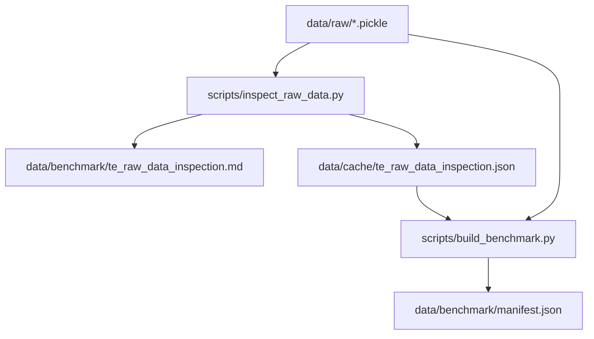
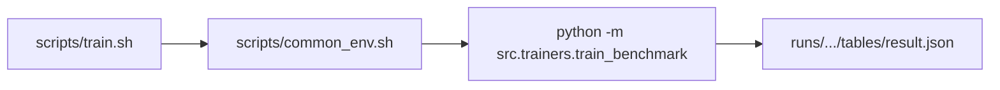
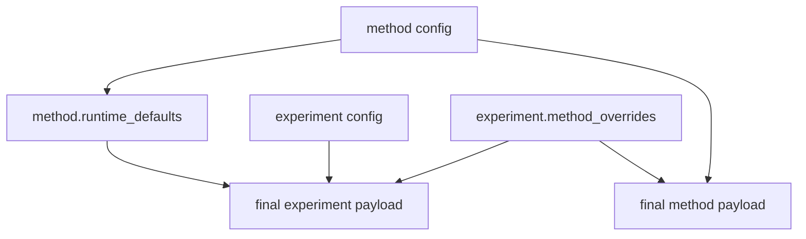
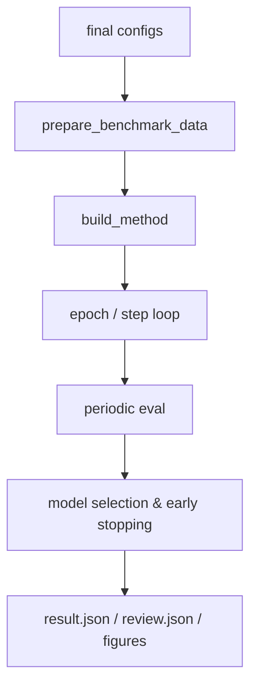
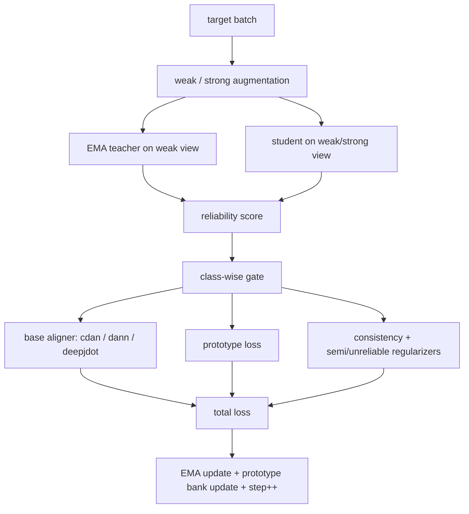
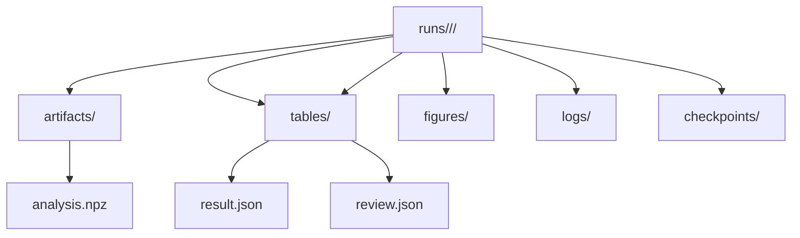

# 本项目工程原理教程

这份文档讲的是“仓库现在到底怎么跑起来”，不是抽象的软件工程口号。内容严格对照当前工作区中的实现，重点覆盖：

- 数据如何从 `data/raw/*.pickle` 变成训练张量
- 配置如何合并并最终落到具体方法
- `scripts/*.sh` 和 `src/*` 之间的调用关系
- 单次训练、批量实验、评估、出图、评审摘要的实际流程
- 当前代码里哪些配置项是真生效的，哪些只是注释性字段或尚未接通

---

## 1. 项目在工程上到底解决什么问题

这套工程要做的事情可以概括成一句话：

> 用统一的数据协议、统一的 FCN 骨干、统一的训练器和统一的结果产物，公平比较多种领域自适应方法，并在此基础上验证 RCTA。

这意味着它不是“每个方法一套训练脚本”的散乱工程，而是一个 **统一 benchmark 框架**：

- 方法差异主要体现在 `src/methods/*.py` 的 `compute_loss()`
- 数据入口统一走 `src/datasets/*`
- 训练入口统一走 `src/trainers/train_benchmark.py`
- 批量实验统一走 `src/automation/run_small_scale_round.py`
- 汇总与出图统一走 `src/evaluation/*`

---

## 2. 目录职责图

| 目录 | 作用 | 当前要点 |
| --- | --- | --- |
| `configs/data/` | 数据路径、规范化、协议默认值 | 当前主文件是 `te_da.yaml` |
| `configs/method/` | 方法默认超参数 | 每个方法一个 YAML |
| `configs/experiment/` | 具体实验轮次、场景、批量计划、覆盖项 | 支持 `automation` 和 `method_overrides` |
| `src/datasets/` | manifest、fold、归一化、DataLoader 准备 | 支持缓存到 `data/cache/benchmark_prepared/` |
| `src/backbones/` | 共享骨干网络 | 当前主干是 FCN |
| `src/losses/` | CORAL、MMD、GRL、CDAN、DeepJDOT 等损失 | 方法层直接调用这里 |
| `src/methods/` | 7 种方法的核心训练步逻辑 | 统一继承 `SingleSourceMethodBase` |
| `src/trainers/` | 训练循环、选模、早停、结果保存 | 所有方法共用 |
| `src/automation/` | 批量实验计划展开与执行 | 用临时 YAML 驱动多轮训练 |
| `src/evaluation/` | 汇总表、回顾摘要、图表导出 | 面向 `runs/` 目录 |
| `scripts/` | shell 入口 | 主要是环境适配和参数转发 |
| `tutorial/` | 教程文档 | 就是你现在看的位置 |

---

## 3. 数据工程主线

### 3.1 原始数据到 manifest

原始数据在 `data/raw/`，当前工程把它视为不可变上游快照。每个 `.pickle` 文件里至少要有三个顶层键：

- `Signals`
- `Labels`
- `Folds`

`scripts/build_benchmark.sh` 最终调用 `scripts/build_benchmark.py`，后者又调用 `src/datasets/te_da_dataset.py` 里的检查与 manifest 构建逻辑。



### 3.2 manifest 当前记录了什么

当前 `data/benchmark/manifest.json` 已经存在，并明确记录了：

- 共 6 个域：`mode1` 到 `mode6`
- 每个域单样本形状统一为 `600 x 34`
- 标签总数统一为 29 类
- 每个域都有 5 个 fold

按当前 manifest，六个域样本总量分别是：

| 域 | 样本数 | 单样本形状 | 类别数 | fold 数 |
| --- | ---: | --- | ---: | ---: |
| mode1 | 2900 | `600 x 34` | 29 | 5 |
| mode2 | 2845 | `600 x 34` | 29 | 5 |
| mode3 | 2899 | `600 x 34` | 29 | 5 |
| mode4 | 2865 | `600 x 34` | 29 | 5 |
| mode5 | 2883 | `600 x 34` | 29 | 5 |
| mode6 | 2897 | `600 x 34` | 29 | 5 |

### 3.3 真正进入训练前发生了什么

`prepare_benchmark_data()` 会完成下面几件事：

1. 读取 manifest，确认域和 fold。
2. 从对应 `.pickle` 里加载 `Signals / Labels / Folds`。
3. 用 held-out fold 构造 train/eval 索引。
4. 做归一化。
5. 若 `channels_first=true`，把样本从 `(N, 600, 34)` 转成 `(N, 34, 600)`。
6. 包装成 `TensorDataset` 和 `DataLoader`。
7. 把准备结果缓存到 `data/cache/benchmark_prepared/*.npz`。

这里最重要的工程事实是：

- 当前默认 `normalization_scope=domain`
- 也就是每个域各自算统计量，再切 train/eval
- 不是全局跨域归一化，也不是默认只用训练折统计量

---

## 4. 训练入口是怎么串起来的

最常用的 shell 入口有四个：

```bash
bash scripts/build_benchmark.sh configs/data/te_da.yaml
bash scripts/train.sh configs/data/te_da.yaml configs/method/dann.yaml configs/experiment/quick_debug.yaml
bash scripts/run_small_scale_round.sh --plan-only
bash scripts/eval.sh runs
```

其中 `scripts/common_env.sh` 做了两件小但很关键的事：

- 如果当前已经激活 `tep_env`，直接用当前 Python
- 否则如果系统里有 `conda`，自动回退到 `conda run -n tep_env python`

同时它还会把 `MPLCONFIGDIR` 指到工作区内的 `data/cache/matplotlib`，避免图形缓存写到用户全局目录。



---

## 5. 配置系统不是平铺的，而是三层叠加

当前工程真正生效的是三类配置：

- 数据配置：`configs/data/*.yaml`
- 方法配置：`configs/method/*.yaml`
- 实验配置：`configs/experiment/*.yaml`

但它们不是简单并列，而是有明确覆盖顺序。



### 5.1 实际顺序

`src/trainers/train_benchmark.py` 的 `main()` 里顺序是：

1. 读入 data / method / experiment YAML
2. 把 `method.runtime_defaults` 合并进 experiment runtime
3. 再应用 `experiment.method_overrides`
4. 再根据最终 method payload 构建模型

所以优先级可以记成：

```text
方法默认值
  < 方法自带 runtime_defaults 注入的实验默认值
  < experiment.runtime
  < experiment.method_overrides
```

### 5.2 为什么这个设计有意义

这使得：

- 每个方法可以声明“我更适合怎样的选模指标”
- 实验配置仍然可以统一接管全局 runtime
- 某一轮实验又可以只改某个方法，而不用复制一份新方法 YAML

CDAN 是最典型例子。它在 `configs/method/cdan.yaml` 里自带了

- `model_selection: hybrid_source_eval_entropy_guard_domain_gap`
- `early_stopping_metric: hybrid_source_eval_entropy_guard_domain_gap`

但在某些 benchmark 配置中，又会被实验层覆盖成更激进的 `hybrid_source_eval_target_confidence`。

---

## 6. 训练器的统一工作流

当前所有方法都走同一个训练器：`src/trainers/train_benchmark.py`。



### 6.1 每个 step 发生什么

训练器会：

1. 从每个源 loader 取一个 batch。
2. 从目标 loader 取一个 batch。
3. 把所有源 batch 拼成 `source_batches`。
4. 调 `model.compute_loss(source_batches, target_batch)`。
5. `loss.backward()`。
6. 可选梯度裁剪。
7. `optimizer.step()`。
8. 再调 `model.after_optimizer_step()`。

这就是为什么：

- 所有方法都只需要专注写 `compute_loss()`
- RCTA 这类带教师网络和原型库的方法，还能把状态更新放进 `after_optimizer_step()`

### 6.2 多源训练是怎么支持的

当前多源支持是 **trainer-level**，不是 **architecture-level**。

具体说：

- 训练器会为每个源域各建一个 loader
- 每步从每个源域取一个 batch
- `SingleSourceMethodBase.merge_source_batches()` 把它们沿 batch 维拼接

因此多源场景当前更接近“多个源域样本共同监督一个共享编码器”，而不是带域专属分支的多源网络。

顺手说一个很容易忽略的事实：`build_method(..., num_sources=...)` 这个参数目前虽然被传入了，但方法构造函数并没有真正使用它。

---

## 7. 选模、早停和为什么不是直接看目标测试集

研究阶段当然能算目标域测试准确率，但工程上并没有把它当成唯一选模依据。训练器支持一组“无标签代理 + 源域指标”的混合策略：

- `source_train`
- `source_eval`
- `target_eval`（oracle 风格，研究时可用）
- `target_confidence`
- `target_entropy`
- `hybrid_source_eval_target_confidence`
- `hybrid_source_eval_inverse_entropy`
- `hybrid_source_eval_entropy_guard_domain_gap`

这些逻辑都在 `src/trainers/selection_metrics.py`。

### 7.1 当前最常见的两个策略

1. `hybrid_source_eval_inverse_entropy`

   \[
   S = w_s \cdot \mathrm{Acc}_{src,eval} - w_h \cdot \bar H_{tgt}
   \]

2. `hybrid_source_eval_target_confidence`

   \[
   S = w_s \cdot \mathrm{Acc}_{src,eval} + w_c \cdot \bar C_{tgt}
   \]

### 7.2 CDAN 的特殊保护

CDAN 默认偏好 `hybrid_source_eval_entropy_guard_domain_gap`，因为它的对抗训练更容易出现：

- 目标域置信度变高了
- 但域判别器其实还没被充分混淆

这个指标会用域判别器准确率偏离 0.5 的程度，对“过早低熵”做惩罚。

---

## 8. 方法注册机制

方法构建在 `src/methods/__init__.py` 里统一完成。

| 方法名 | 实现文件 | 关键差异 |
| --- | --- | --- |
| `source_only` | `src/methods/source_only.py` | 只有源域 CE |
| `coral` | `src/methods/coral.py` | 调 `coral_loss()` |
| `dan` | `src/methods/dan.py` | 调 MK-MMD |
| `dann` | `src/methods/dann.py` | 域判别器 + GRL |
| `cdan` | `src/methods/cdan.py` | 条件域对抗 + 可选 MCC |
| `deepjdot` | `src/methods/deepjdot.py` | OT 对齐 |
| `rcta` | `src/methods/rcta.py` | 教师、门控、原型、课程调度、可切换基础对齐 |

工程上最漂亮的一点是：

> 训练器不需要知道每个方法的内部结构，只要求它们都提供统一的 `compute_loss()` 和可选的 `after_optimizer_step()`。

---

## 9. RCTA 在工程上是怎么落地的

RCTA 的核心实现文件是 `src/methods/rcta.py`。它内部不是一个单块，而是拆成了几个可组合部件：

- `_TemporalAugmenter`
- `_ReliabilityGate`
- `_ReliabilityPartition`
- `_CDANAligner`
- `_DANNAligner`
- `_DeepJDOTAligner`
- `RCTAMethod`



### 9.1 当前代码里的几个关键事实

1. `base_align` 真的是可切换的，不是写死 DANN。
2. 对齐分支可以延后到若干 step 之后才启动。
3. 对齐时可以只使用可靠目标样本。
4. 主一致性损失是 MSE，不是 KL。
5. 目标原型记忆更新使用的是所有 teacher 特征和 argmax 伪标签，不只门控样本。

这些都直接影响你如何理解实验现象。

---

## 10. 批量实验不是硬编码，而是“计划展开 + 临时 YAML”

`scripts/run_small_scale_round.sh` 实际调用的是 `src/automation/run_small_scale_round.py`。

它会：

1. 读 experiment config
2. 解析 `automation.methods`
3. 解析 `single_source_scenes / multisource_scenes / multisource_targets`
4. 展开成 run plan
5. 为每个 run 生成一份临时 experiment YAML
6. 调 `bash scripts/train.sh ... --batch-root-name ...`

所以它不是在代码里写死“跑哪几个方法哪几个场景”，而是一个配置驱动的展开器。

### 10.1 一个实际例子

`configs/experiment/quick_debug.yaml` 当前会展开成：

- 2 个单源场景：`mode1->mode4`、`mode4->mode1`
- 6 个方法
- 共 12 个 run

而 `configs/experiment/benchmark_56_8scenes_7methods_rcta_best.yaml` 这个文件名和注释都写着“8 场景 / 7 方法”，但**以当前仓库内容来看，automation 里只有 4 个 `single_source_scenes` 真正启用，多源块是注释掉的**。

也就是说，当前直接执行：

```bash
bash scripts/run_small_scale_round.sh \
  --experiment-config configs/experiment/benchmark_56_8scenes_7methods_rcta_best.yaml \
  --plan-only
```

按代码实际会展开为：

- 4 个场景
- 7 个方法
- 共 28 个 run

除非你手动把多源场景重新打开，或者换一个真正包含多源场景的 experiment config。

---

## 11. 结果产物布局

单次 run 的输出目录由 `src/utils/run_layout.py` 统一创建。



典型产物包括：

- `tables/result.json`
- `tables/review.json`
- `artifacts/analysis.npz`
- `figures/tsne_domain.png`
- `figures/tsne_class.png`
- `figures/confusion_matrix.png`
- `checkpoints/model.pt`（若启用）

### 11.1 `result.json` 里有什么

训练器最终会把以下信息写进去：

- 方法名、场景名、源域列表、目标域
- 每个 epoch 的 history
- 选中的 epoch
- 选模分数与早停信息
- source/target accuracy
- `save_analysis=true` 时额外写入的 target balanced accuracy
- `save_analysis=true` 时额外写入的 confusion matrix
- `save_analysis=true` 时额外写入的 analysis artifact 路径
- 运行设备与缓存命中状态

### 11.2 `review.json` 是做什么的

`src/evaluation/review.py` 会根据结果自动给一轮 run 打上轻量级评审标签，例如：

- `source_training_weak`
- `source_generalization_weak`
- `target_transfer_weak`
- `over_alignment_suspect`
- `visual_artifacts_missing`

这使得批量实验之后，你不必手工逐个 run 先筛一遍“谁明显有问题”。

---

## 12. 汇总与出图

### 12.1 汇总

`bash scripts/eval.sh runs` 会调用 `src/evaluation/evaluate.py`：

- 搜索所有 `tables/result.json`
- 抽取核心指标
- 与 `source_only` 做同场景差值比较
- 输出 Markdown 表和 JSON 汇总

### 12.2 出图

`bash scripts/export_figures.sh runs` 会调用 `src/evaluation/report_figures.py`，导出：

- 方法平均目标域准确率柱状图
- 按场景热力图
- 运行级 t-SNE
- 混淆矩阵图

如果这是一个 batch root，训练器在每个 run 完成后还会自动刷新该 batch 的 comparison summary 和 summary figures。

---

## 13. 你真正跑实验时最该盯的配置文件

### 13.1 单方法默认值

- `configs/method/source_only.yaml`
- `configs/method/coral.yaml`
- `configs/method/dan.yaml`
- `configs/method/dann.yaml`
- `configs/method/cdan.yaml`
- `configs/method/deepjdot.yaml`
- `configs/method/rcta.yaml`

### 13.2 常用实验入口

- `configs/experiment/quick_debug.yaml`
- `configs/experiment/benchmark_72.yaml`
- `configs/experiment/benchmark_56_8scenes_7methods_rcta_best.yaml`
- `configs/experiment/rcta_*.yaml`

### 13.3 如果你只想改一轮实验

最安全的方式通常不是改方法默认 YAML，而是：

1. 复制或新建一个 experiment config
2. 在 `method_overrides` 里只改本轮想改的内容
3. 用 `--plan-only` 先看展开结果
4. 再正式跑

这样不会污染“方法默认定义”和“某一轮实验策略”之间的边界。

---

## 14. 当前仓库里几个非常值得注意的“一致性提醒”

下面这些不是理论问题，而是你做实验时容易踩到的工程事实。

### 14.1 `benchmark_56_8scenes_7methods_rcta_best.yaml` 目前不会自动跑满 8 场景

原因前面已经说过：多源块现在是注释状态。

### 14.2 `configs/data/te_da.yaml` 里有字段目前并未被 `TEDADatasetConfig.from_dict()` 消费

当前这两个键是“说明性字段”，不是实际生效逻辑：

- `loading.preferred_source`
- `loading.allow_raw_fallback`

它们写在 YAML 里没问题，但现阶段不会改变数据准备代码行为。

### 14.3 `benchmark_56_8scenes_7methods_rcta_best.yaml` 里的 `coral.loss.adapt_mean` 不是有效代码键

当前 CORAL 实现真正读取的是：

- `align_mean`
- `normalize_covariance`

所以 `adapt_mean` 这个键本身不会被代码消费。好在同一段 override 里也写了 `align_mean: true`，所以实验不会因为这个拼写多出来的键而失效。

### 14.4 RCTA 的 DeepJDOT 基础分支目前没有把 solver 相关 YAML 参数完全接通

`configs/method/rcta.yaml` 以及部分 experiment override 里给了：

- `transport_solver`
- `sinkhorn_reg`
- `sinkhorn_num_iter_max`

但当前 `build_method()` 传给 `RCTAMethod(... deepjdot_kwargs=...)` 的内容只包括：

- `adaptation_weight`
- `adaptation_schedule`
- `adaptation_max_steps`
- `adaptation_schedule_alpha`
- `reg_dist`
- `reg_cl`
- `normalize_feature_cost`

也就是说，**当 RCTA 使用 `base_align: deepjdot` 时，这几个 solver 细节目前不会真正传进 `_DeepJDOTAligner`**。仓库当前行为更接近“固定用 `deepjdot_loss()` 的默认 solver 设置”。

这点在写论文或做超参数对照时一定要注意。

---

## 15. 最后给出一条最实用的工程理解线

如果你要向别人解释这套工程，最清楚的讲法是：

1. 原始 TEP 数据先被检查并登记到 manifest。
2. `prepare_benchmark_data()` 负责把 manifest、fold、归一化、缓存和 DataLoader 全部处理掉。
3. `train_benchmark.py` 是统一训练器，所有方法都在同一套训练循环里跑。
4. 方法之间真正的差异主要只有 `compute_loss()`。
5. experiment config 不是“附属说明”，而是批量计划、runtime 策略和 per-method 覆盖的总控台。
6. 训练结束后，结果不是只剩一个 accuracy 数字，而是同时产出 JSON、review、分析特征和图表，方便后续论文和复盘。

这就是本项目的工程原理主轴。
